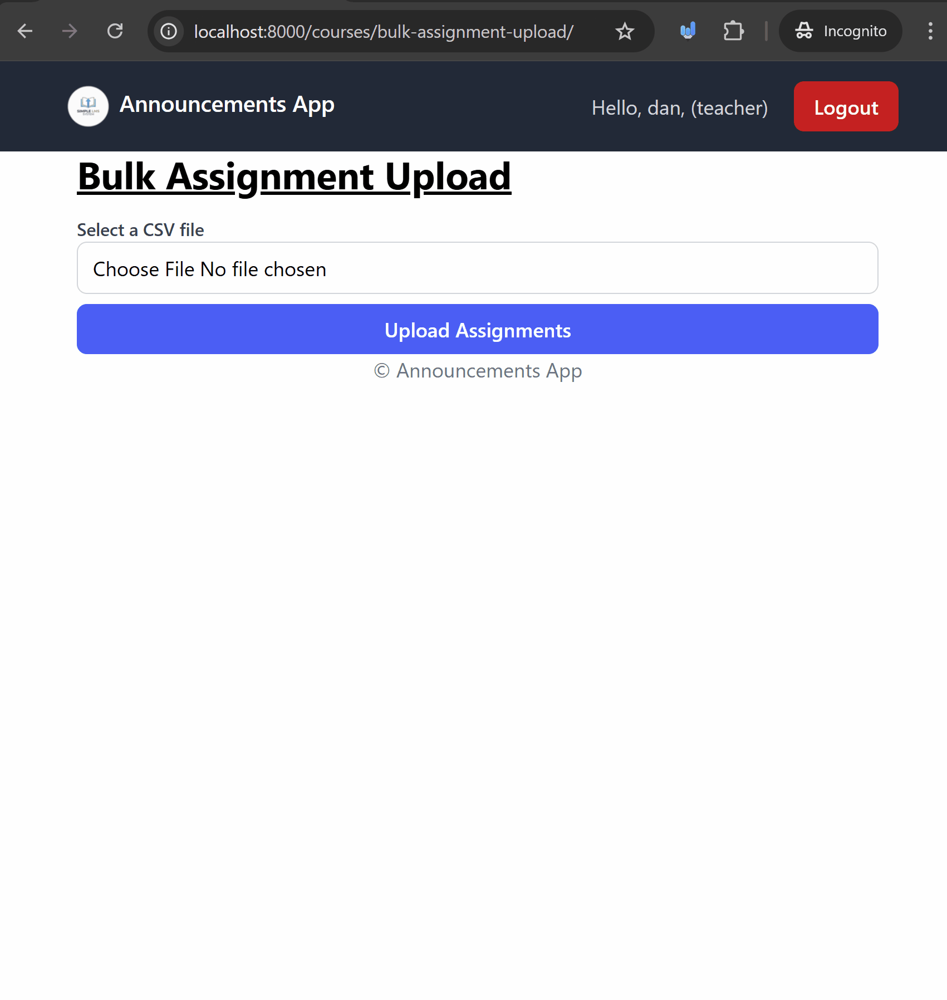

# Files and Media - Uploading Images

Handling non image files is something very similar to handling image files in Django. The main difference is that instead of using an `ImageField`, we use a `FileField`.

This is very common way to import data in bulk into a web application, especially in educational applications where teachers may want to create multiple assignments at once using a CSV file.

## Prerequisites
- Create a new virtual environment and install the packages from the `requirements.txt` file.

## Steps

We're going to make a web application where users can upload non-image files (PDFs, CSVs, etc.) and then download them later.

We'll be doing this by creating an app where we can create `Assignments` in bulk using a CSV file contents, and then students can submit their work by uploading files.

### 1. Let's create an app called `courses` with the models `Assignment` and `Submission`.

#### 1.1 Create the `courses` app and add it to `INSTALLED_APPS` in `settings.py`

```bash
python manage.py startapp courses
```

Then, add `"courses",` to the `INSTALLED_APPS` list in `settings.py`.
```python
INSTALLED_APPS = [
    ...
    "courses",
]
```
Also ensure that your `MEDIA_URL` and `MEDIA_ROOT` settings are configured in `settings.py`:

```python

# ... other settings ...

# Media files
MEDIA_URL = '/media/'
MEDIA_ROOT = BASE_DIR / 'media'
```

#### 1.2 Add the following models to `courses/models.py`
We're going to add two models: `Assignment` and `Submission`.

```python
from django.conf import settings

class Assignment(models.Model):
    title = models.CharField(max_length=200)
    description = models.TextField()
    due_date = models.DateTimeField()
    created_at = models.DateTimeField(auto_now_add=True)
    updated_at = models.DateTimeField(auto_now=True)
    owner = models.ForeignKey(
        settings.AUTH_USER_MODEL,
        on_delete=models.CASCADE,
        related_name="assignments",
    )

    def __str__(self):
        return self.title

class Submission(models.Model):
    assignment = models.ForeignKey(
        Assignment,
        on_delete=models.CASCADE,
        related_name="submissions",
    )

    student_name = models.CharField(max_length=100)

    file = models.FileField(upload_to='submissions/')
    submitted_at = models.DateTimeField(auto_now_add=True)

    def __str__(self):
        return f"Submission by {self.student_name} for {self.assignment}"
```


#### 1.3 Register the models in `courses/admin.py`

```python
from django.contrib import admin
from .models import Assignment, Submission

admin.site.register(Assignment)
admin.site.register(Submission)
```

#### 1.4 Let's create and apply the migrations.

```bash
python manage.py makemigrations
python manage.py migrate
```

### 2. Let's add form to bulk upload assignments with a csv file.

Let's create a form that allows us to upload a csv file with multiple assignments.

#### 2.1 Create a form in `courses/forms.py` to accept a CSV file upload.

Create the file `courses/forms.py` and add the following code:

```python
from django import forms

class BulkAssignmentUploadForm(forms.Form):
    csv_file = forms.FileField(label="Select a CSV file")

    # Let's add some validation to ensure the uploaded file is a CSV
    def clean_csv_file(self):
        file = self.cleaned_data.get('csv_file')
        # Validate file type extension
        if not file.name.endswith('.csv'):
            raise forms.ValidationError("Please upload a valid CSV file.")

        # Check the content type
        if file.content_type != 'text/csv':
            raise forms.ValidationError("File type is not CSV.")

        return file

```
Let's talk about what we did here.
- We created a form with a single `FileField` to upload the CSV file.
- We added a custom validation method `clean_csv_file` to ensure that the uploaded file is indeed a CSV file by checking its extension and content type.
    - If the file name does not end with `.csv`, we raise a `ValidationError`.
    - We also check the content type of the file to ensure it is `text/csv`. If not, we raise another `ValidationError`.

Try to upload an image file or a non-csv file to see the validation in action.

#### 2.2. Let's create `bulk_assignment_upload` view to handle the form, and add the corresponding template.

Let's add the following view in `courses/views.py`:
```python
from django.shortcuts import render, redirect
from django.contrib.auth.decorators import login_required

from .forms import BulkAssignmentUploadForm

# Create your views here.
@login_required
def bulk_assignment_upload(request):
    success = False
    if request.method == 'POST':
        form = BulkAssignmentUploadForm(request.POST, request.FILES)
        if form.is_valid():
            # Process the uploaded CSV file
            csv_file = form.cleaned_data['csv_file']
            # we're going to add a parser for this csv file later.
            success = True
    else:
        form = BulkAssignmentUploadForm()

    return render(request, 'courses/bulk_assignment_upload.html', {
        'form': form,
        'success': success,
    })

```

Add the following template in `courses/templates/courses/bulk_assignment_upload.html`:

```html



Assignment Upload


<div class="max-w-2xl mx-auto px-4 md:px-0">
  <div class="flex justify-between items-center mb-4">

    <h1 class="text-3xl font-bold underline">
      Bulk Assignment Upload
    </h1>
  </div>
  <!-- IMPORTANT: You need enctype="multipart/form-data -->
  <form method="post" enctype="multipart/form-data">
    
    
      <div>
        <label for="{{ field.id_for_label }}" class="block text-sm font-medium text-gray-700">
          {{ field.label }}
        </label>
        {{ field }}
        
          <p class="text-sm text-red-500 mt-1">{{ field.errors|striptags }}</p>
        
      </div>
    
    
    <div class="mt-4 mb-4 p-4 bg-red-100 text-red-800 border border-red-200 rounded">
        <ul>
            
            <li>{{ error }}</li>
            
        </ul>
    </div>
    
    <button type="submit" class="mt-2 w-full bg-blue-600 hover:bg-blue-700 text-white font-semibold py-2 px-4 rounded-lg">
      Upload Assignments
    </button>
  </form>

</div>

```

#### 2.3 Let's add the URL patterns for this app in `courses/urls.py` and include it in the main project's `urls.py`.

Create a `courses/urls.py` file and add the following code:
```python
from django.urls import path
from .views import bulk_assignment_upload

urlpatterns = [
    path('bulk-assignment-upload/', bulk_assignment_upload, name='bulk_assignment_upload'),
]
```

Go to the `announcements_project/urls.py` file and add the following imports at the top:

```python
from django.conf import settings
from django.conf.urls.static import static
from django.urls import include, path

urlspatterns = [
    path('admin/', admin.site.urls),
    path('', include('core.urls')),
    path('announcements/', include('announcements.urls')),
    path('profiles/', include('profiles.urls')),
    # include the courses app urls
    path('courses/', include('courses.urls')),
]
```

### 3. Let's handle the file in the request and parse the CSV to create assignments.

We're going to use the built-in `csv` module to parse the CSV file and create assignments in bulk.

We're going to use the csvs in the folder `csvs-to-use` which all have four columns: `title`, `description`, `date`, and `time`.

#### 3.1 Let's create a `classmethod` in the `Assignment` model to handle creating assignments from a CSV file.

Add the following method to the `Assignment` model in `courses/models.py`:

```python
import csv

# ... existing imports ...

from django.utils import timezone
from datetime import datetime


class Assignment(models.Model):
    # ... existing fields ...

    @classmethod
    def create_assignments_from_csv(cls, csv_file, owner):
        # Decodes the uploaded file to a string.
        decoded_file = csv_file.read().decode('utf-8').splitlines()
        # Use csv.DictReader to parse the CSV file
        reader = csv.DictReader(decoded_file)
        assignments = []
        for row in reader:
            # Parse date and time
            naive_dt = datetime.strptime(
                f"{row['date']} {row['time']}",
                "%Y-%m-%d %H:%M"
            )
            dt = timezone.make_aware(naive_dt)
            # create assignment
            new_assignment, created = Assignment.objects.get_or_create(
                title=row['title'],
                description=row['description'],
                due_date=dt,
                owner=owner
            )
            # keep track of created assignments
            assignments.append(new_assignment)
        # return the assignments created.
        return assignments
```
Let's talk about what we did here.
- We created a class method `create_assignments_from_csv` that takes a CSV file and an owner (the user creating the assignments). This means that you call this function on the class itself, not on an instance of the class.
- We read and decode the uploaded CSV file, then use `csv.DictReader` to parse it.
- For each row in the CSV, we parse the date and time, create a timezone-aware `due_date`, and then create an `Assignment` instance using `get_or_create` to avoid duplicates.
- We collect all created assignments in a list and return it.

#### 3.2 Update the `bulk_assignment_upload` view to use the new class method to create assignments.

Update the `bulk_assignment_upload` view in `courses/views.py` as follows:

```python
# ... existing imports ...
from .models import Assignment

# Create your views here.
@login_required
def bulk_assignment_upload(request):
    success = False
    assignments = []
    if request.method == 'POST':
        form = BulkAssignmentUploadForm(request.POST, request.FILES)
        if form.is_valid():
            # Process the uploaded CSV file
            csv_file = form.cleaned_data['csv_file']
            # C
            assignments = Assignment.create_assignments_from_csv(csv_file, owner=request.user)
            # Note
            success = True
    else:
        form = BulkAssignmentUploadForm()

    return render(request, 'courses/bulk_assignment_upload.html', {
        'form': form,
        'success': success,
        'assignments': assignments,
    })
```
Let's talk about what we did here.
- We imported the `Assignment` model to use the new class method.
- In the view, after validating the form, we call `Assignment.create_assignments_from_csv`, passing in the uploaded CSV file and the current user as the owner.
- We store the returned assignments in a variable and pass it to the template for display.

### 3.3 Let's update the template to show the created assignments after a successful upload.

Let's display the created assignments in the `courses/templates/courses/bulk_assignment_upload.html` template.
- we're only going to add the code right after the title div.
```html
<!-- Existing code -->

<div class="max-w-2xl mx-auto px-4 md:px-0">
  <div class="flex justify-between items-center mb-4">

    <h1 class="text-3xl font-bold underline">
      Bulk Assignment Upload
    </h1>
  </div>
  <!-- Add the success message here -->

  
  <div class="mb-4 p-4 bg-green-100 text-green-800 border border-green-200 rounded">
    <p>Following Assignments uploaded successfully!</p>
    <ul>
        
        <li>{{ assignment.title }} - Due: {{ assignment.due_date }}</li>
        

    </ul>
  </div>
  
  <!-- Existing form code -->
```
So all we did here was add a conditional block that checks if the upload was successful. If it was, we display a success message along with a list of the created assignments and their due dates (that we passed from the view).

Let's take a look at what this looks like and the saved assignment data in the admin panel.


### 4. Let's add a view to see all assignments and create a submission view for an assignment.

#### 4.1 Let's create a view to list all assignments in `courses/views.py` and a placeholder for the submission view.

Add the following views to `courses/views.py`:

```python
# ... existing imports ...

@login_required
def assignment_list(request):
    assignments = Assignment.objects.all().order_by('-created_at')
    return render(request, 'courses/assignment_list.html', {
        'assignments': assignments,
    })

@login_required
def assignment_submission(request, assignment_id):
    # Placeholder for submission view
    return render(request, 'courses/assignment_submission.html', {
        'assignment_id': assignment_id,
    })
```
This will have two views: one to list all assignments and another as a placeholder for submitting an assignment.

#### 4.2 Let's add the URL patterns for these views in `courses/urls.py`.

Update the `courses/urls.py` file to include the new views:

```python
from django.urls import path

from .views import bulk_assignment_upload, assignment_list, assignment_submission

urlpatterns = [
    path('bulk-assignment-upload/', bulk_assignment_upload, name='bulk_assignment_upload'),
    path('assignments/', assignment_list, name='assignment_list'),
    path('assignments/<int:assignment_id>/submit/', assignment_submission, name='assignment_submission'),
]
```

#### 4.3 Let's create templates for the assignment list and submission views.

Create the file `courses/templates/courses/assignment_list.html` and add the following code:

```html



Assignments


<div class="max-w-2xl mx-auto px-4 md:px-0">
  <div class="flex justify-between items-center mb-4">

    <h1 class="text-3xl font-bold underline">
      Assignments
    </h1>
  </div>
  <ul>
    
    <li class="mb-4 p-4 border border-gray-200 rounded">
      <h2 class="text-xl font-semibold">{{ assignment.title }}</h2>
      <p>{{ assignment.description }}</p>
      <p class="text-sm text-gray-600">Due: {{ assignment.due_date }}</p>
      <a href="" class="text-blue-600 hover:underline">Submit Assignment</a>
    </li>
    
    <li>No assignments available.</li>
    
  </ul>
</div>

```

Create the file `courses/templates/courses/assignment_submission.html` and add the following code:

```html



Submit Assignment


<div class="max-w-2xl mx-auto px-4 md:px-0">
  <div class="flex justify-between items-center mb-4">

    <h1 class="text-3xl font-bold underline">
      Submission for Assignment {{ assignment_id }}
    </h1>
  </div>
    <p>This is a placeholder for the assignment submission form.</p>
</div>

```

#### 4.4 Let's add a link to the assignment list in the navigation bar.
Update the navigation bar in `templates/base.html` to include a link to the assignment list in the authenticated user section.

```html
<!-- Add the assignment list url. -->
<a href="" class="px-4 py-2 mr-2 bg-green-600 text-white font-semibold rounded-lg hover:bg-green-700 focus:outline-none focus:ring-2 focus:ring-green-500 focus:ring-offset-2">
    Assignments
</a>
```

## Challenge/Exercise
### 1. Implement the assignment submission functionality
- in the `assignment_submission` view, implement the logic to handle file uploads for assignment submissions.
  - Create a form for the `Submission` model that includes a `FileField` for uploading the submission file and a `CharField` for the student's name.
- Handle the form submission in the view, saving the uploaded file and creating a new `Submission` instance linked to the corresponding `Assignment`.
- Display a successful message upon successful submission.

### 2. Display submissions for each assignment and restrict access to a teacher role, and only show assignments created by the logged-in teacher.
- Create an `teacher_assignment_list` view that lists assignments created by the logged-in teacher.
- Create a `submission_list` view that displays all submissions for a specific assignment.
- Restrict access to these views to users with a teacher role only.
- Display the list of submissions in a template, showing the student's name and a link to download the submitted file (Note it's the same as image/file download we did in the last walk through).

## Conclusion

In this lesson, we learned how to handle non-image file uploads in a Django application. We created a form to upload CSV files, parsed the contents to create multiple `Assignment` instances, and displayed the created assignments. We also set up views and templates to list assignments and provide a placeholder for assignment submissions.
