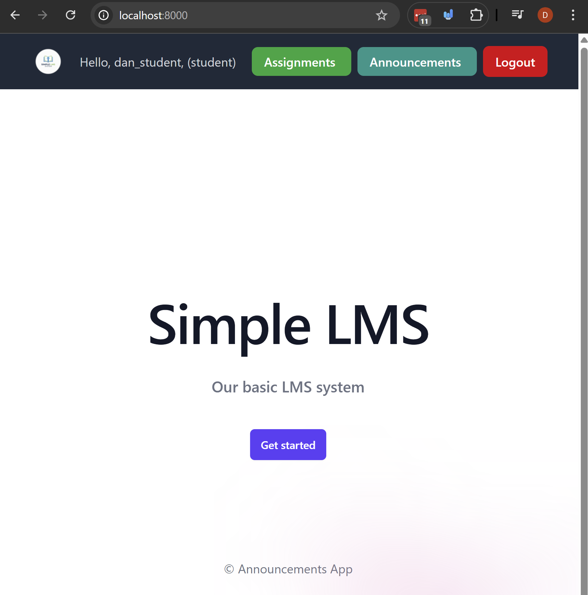

# Django Class Based Views.

So far in the course we've been using function based views to handle requests and return responses. In this lesson we're going to learn about class based views (CBVs) which provide an alternative way to define views using Python classes instead of functions.

Both function based views and class based views are valid approaches in Django, and each has its own advantages and use cases. Class based views can help organize code better, promote code reuse through inheritance and mixins, and provide built-in generic views for common patterns.

This will also prepare us for using Django Rest Framework later in the course, which heavily utilizes similar class based view concepts.

Please heavily refer to the official Django documentation on [class based views here](https://docs.djangoproject.com/en/5.2/topics/class-based-views/).

## Prerequisites
- Create a new virtual environment and install the packages from the `requirements.txt` file.

## Steps

### Step 1: Create a `View` for the homepage and add the url.

#### 1.1 Create a new app called `web`:

```bash
python manage.py startapp web
```

Add it to the `INSTALLED_APPS` in `settings.py`:

```python
INSTALLED_APPS = [
    # ...other apps...
    'web',
]
```


#### 1.2 In `web/views.py`, create a `View` for the homepage, with a template.
In the past we've written function based views like this:

```python
from django.shortcuts import render

def home_page_view(request):
    return render(request, 'web/home.html')
```
This is fine, but with class based views we can write the same view using a class that inherits from `View` below.

In `web/views.py`, Create a view called `HomePageView` that inherits from `View` and override the `get` method to render a template:

```python
from django.views import View
from django.shortcuts import render


class HomePageView(View):
    def get(self, request):
        return render(request, 'web/home.html')
```

Copy the `home.html` template from the base of this example into `web/templates/web/home.html`:


#### 1.3 add the url for the homepage view in `web/urls.py` and include it in the main `urls.py`:

Create a `urls.py` file in the `web` app and add the following code:

```python
from django.urls import path

urlpatterns = [
    path('', HomePageView.as_view(), name='home'),
]
```
This is a bit different than how we used to add urls for function based views. For class based views, we need to call the `as_view()` method on the view class to get a callable view that can be used in the URL patterns.

Then, include the `web` app's urls in the main `announcements_projects/urls.py`:

```python
from django.contrib import admin
from django.urls import path, include
from django.conf import settings
from django.conf.urls.static import static

urlpatterns = [
    path('', include('web.urls')),  # Include the web app urls
    # ...other urls...
]

# ...media urls...
```

You can see now that we have a base template for our simple lms system with a class based view!

#### 1.4 Let's modify the `base.html` template to add a link to the home page and modify the navbar to add a link to the `announcements_list` view.

Open the `templates/base.html` and modify the title so that it links to the home page:

```html
<!-- ... this inside the header block... -->

<!-- Title -->
<a href="" class="flex text-white text-lg font-semibold">
    <!-- Added image -->
    
</a>
```

Also in the `templates/base.html` file and modify the navbar to include a link to the home page and the announcements list page:

```html
<!-- ... this inside the header block... -->
<a href="" class="px-4 py-2 mr-2 bg-teal-600 text-white font-semibold rounded-lg hover:bg-teal-700 focus:outline-none focus:ring-2 focus:ring-teal-500 focus:ring-offset-2">
    Announcements
</a>
<!-- Rest of the app  -->
```

At the end of this step you should see something like this when you visit the homepage when you're logged in:


### Step 2: Let's refactor the views in `announcements/views.py` to use class based views instead of function based views.

#### 2.1 Let's refactor the `announcement_list` view to use a class based view.

Currently our function based view for the announcement list looks like this:

```python
# ... code above ...
@login_required
def announcement_list(request):
    announcements = Announcement.objects.all().order_by('-created_at')
    return render(
        request,
        'announcements/announcement_list.html',
        {'announcements': announcements}
    )
```

To refactor this in a class based view we're going to use `View` and override the `get` method to handle GET requests (we're going to add the login required decorator in the next step):

```python

from django.views import View

# ... is teacher function and other imports ...

class AnnouncementListView(View):
    template_name = 'announcements/announcement_list.html'

    def get(self, request):
        announcements = Announcement.objects.all().order_by('-created_at')
        return render(
            request,
            self.template_name,
            {'announcements': announcements}
        )
```
So note here:
- We define a class `AnnouncementListView` that inherits from `View`.
- We specify the template to be rendered using the `template_name` attribute.
- We override the `get` method to handle GET requests. Inside the `get` method, we retrieve the announcements and render the template with the context.
- We haven't added the login required decorator yet, we'll add that in the next step.


Then we need to update the url for the announcement list view in `announcements/urls.py` to use the new class based view:

```python
from django.urls import path
from .views import AnnouncementListView, create_announcement

urlpatterns = [
    path('', AnnouncementListView.as_view(), name='announcement_list'),
    path('create/', create_announcement, name='create_announcement'),
]
```

#### 2.2 Let's add the login required decorator to the `AnnouncementListView` class based view.

To add the login required decorator to a class based view, we can use the `method_decorator` from `django.utils.decorators` to apply the decorator to the `dispatch` method of the view. The `dispatch` method is called for every request and is responsible for dispatching the request to the appropriate handler method (like `get`, `post`, etc.).

Here's how we can modify the `AnnouncementListView` to require login:

```python
from django.utils.decorators import method_decorator
from django.contrib.auth.decorators import login_required

# ... other imports and is_teacher function ...

@method_decorator(login_required, name='dispatch')
class AnnouncementListView(View):
    template_name = 'announcements/announcement_list.html'

    def get(self, request, *args, **kwargs):
        announcements = Announcement.objects.all().order_by('-created_at')
        return render(
            request,
            self.template_name,
            {'announcements': announcements}
        )
```

### 3. Let's refactor the `create_announcement` view to use a class based view.

So far we've only refactored views that handle GET requests, but we can also refactor views that handle POST requests. The `create_announcement` view currently looks like this:

So far our `create_announcement` view looks like this:
```python
@login_required
@user_passes_test(is_teacher, login_url='login')
# @permission_required('announcements.add_announcement', raise_exception=True) # the optional section
def create_announcement(request):
    if request.method == 'POST':
        form = AnnouncementForm(request.POST)
        if form.is_valid():
            announcement = form.save(commit=False)
            # the commit false will prevent the form from saving to the database
            # set the created_by field to the current user
            announcement.created_by = request.user
            announcement.save()
            # save the announcement to the database.
            return redirect('announcement_list')
    else:
        form = AnnouncementForm()
    return render(request, 'announcements/create_announcement.html', {'form': form})
```

Let 's refactor this to use a class based view. Since this view handles both GET and POST requests, we can use the `View` class and override both the `get` and `post` methods

```python
from django.views import View
from django.utils.decorators import method_decorator
from django.contrib.auth.decorators import login_required, user_passes_test

@method_decorator(login_required, name='dispatch')
@method_decorator(user_passes_test(is_teacher, login_url='login'), name='dispatch')
class CreateAnnouncementView(View):
    template_name = 'announcements/create_announcement.html'
    form_class = AnnouncementForm

    def get(self, request, *args, **kwargs):
        form = self.form_class()
        return render(request, self.template_name, {'form': form})

    def post(self, request, *args, **kwargs):
        form = self.form_class(request.POST)
        if form.is_valid():
            announcement = form.save(commit=False)
            announcement.created_by = request.user
            announcement.save()
            return redirect('announcement_list')
        return render(request, self.template_name, {'form': form})
```
Let's break down what's happening here:
- We define a class `CreateAnnouncementView` that inherits from `View`.
- We use the `method_decorator` to apply the `login_required` and `user_passes_test` decorators to the `dispatch` method of the view, which will ensure that all requests to this view require the user to be logged in and pass the teacher
- We specify the template to be rendered using the `template_name` attribute and the form class using the `form_class` attribute.
- We override the `get` method to handle GET requests. In the `get` method, we create an instance of the form and render the template with the form in the context.
- We override the `post` method to handle POST requests. In the `post` method, we create an instance of the form with the POST data, validate it, and if it's valid, we save the announcement and redirect to the announcement list. If the form is not valid, we render the template again with the form (which will include error messages).


Then we need to update the url for the create announcement view in `announcements/urls.py` to use the new class based view:

```python
from django.urls import path
from .views import AnnouncementListView, CreateAnnouncementView

urlpatterns = [
    path('', AnnouncementListView.as_view(), name='announcement_list'),
    path('create/', CreateAnnouncementView.as_view(), name='create_announcement'),
]
```

## Challenge/Exercise

Refactor all of the views in the `courses` app to use class based views instead of function based views. You can use the `View` class and override the appropriate methods (`get`, `post`, etc.) to handle the requests. Don't forget to add the necessary decorators for authentication and permissions.

We'll do this together after you try it on you own. You can refer to the official Django documentation on class based views for more details and examples: https://docs.djangoproject.com/en/5.2/topics/class-based-views/.


## Conclusion

In this lesson, we learned about class based views in Django and how to use them to handle requests and return responses. We refactored our existing function based views to use class based views.