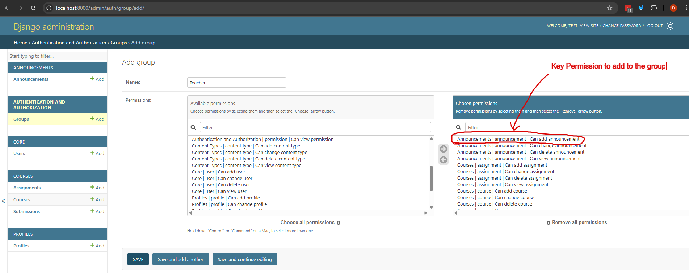
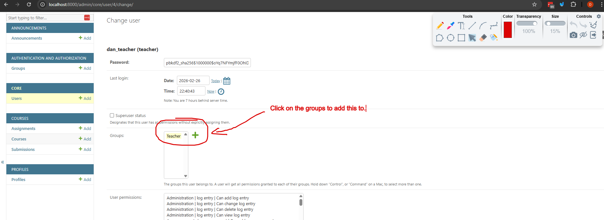

# Django Generic Class Based Views and Mixins

Last class and example we took a look at the fundamentals of class based views in Django.

In this example we'll be converting our method decorators to use mixin classes instead. This is a more elegant way to handle authentication and permissions in class based views, and it allows us to reuse the same logic across multiple views without having to repeat ourselves.

We'll be using much of the [auth permission mixins here](https://docs.djangoproject.com/en/5.2/topics/auth/default/)

We'll also be refactoring our views to use some of the generic class based views that Django provides, which can help reduce boilerplate code and make our views more concise. This is a bit of a controversial topic in the Django community, but it's good to know how to use them and when to use them.

## Prerequisites
- Create a new virtual environment and install the packages from the `requirements.txt` file.

## Steps

### Step 1:Open the `views.py` file in the `announcements` app and modify the `AnnouncementListView` to use the `LoginRequiredMixin`.

So far in this course we've been using method decorators to handle authentication and permissions in our class based views. While this works, it's not the most elegant solution. It also doesn't allow us to reuse the same logic across multiple views without having to repeat ourselves.

Let's refactor the views in announcements app to use mixin classes instead.

So far we have in our view.
```python
from django.views import View
from django.utils.decorators import method_decorator
from django.shortcuts import render, redirect
# import login_required decorator
from django.contrib.auth.decorators import login_required, user_passes_test, permission_required

# ... other imports and is_teacher function ...

@method_decorator(login_required, name='dispatch')
class AnnouncementListView(View):
    template_name = 'announcements/announcement_list.html'

    def get(self, request):
        announcements = Announcement.objects.all().order_by('-created_at')
        return render(
            request,
            self.template_name,
            {'announcements': announcements}
        )

# ... other classes ...
```

Let's refactor this to use the `LoginRequiredMixin` instead of the `login_required` decorator, it does the same thing but this can be a bit cleaner and more reusable.

```python
from django.contrib.auth.mixins import LoginRequiredMixin

class AnnouncementListView(LoginRequiredMixin, View):
    template_name = 'announcements/announcement_list.html'

    def get(self, request):
        announcements = Announcement.objects.all().order_by('-created_at')
        return render(
            request,
            self.template_name,
            {'announcements': announcements}
        )
```
Let's breakdown the changes here:
- We've removed the `method_decorator` and the `login_required` decorator from the class.
- We've imported the `LoginRequiredMixin` from `django.contrib.auth.mixins` [docs for the item here](https://docs.djangoproject.com/en/5.2/topics/auth/default/#the-loginrequiredmixin-mixin)/

That's it really, they perform the exact same way.

Now if you try to access `http://localhost:8000/announcements/` without being logged in, you will be redirected to the login page. If you are logged in, you will see the list of announcements.


### Step 2: Refactor the `AnnouncementCreateView` to use a custom class `IsTeacherRoleMixin` that implements `UserPassesTestMixin` instead of the `user_passes_test` decorator.

So we want to create a mixin that checks to see if the user has a teacher role and if they do they can access the view, otherwise they will be redirected to the login page (the exact same behavior as the `user_passes_test` decorator).

First let's create a new file in the `core` app called `mixins.py` and add the following code to it:

```python
from django.contrib.auth.mixins import UserPassesTestMixin

class IsTeacherRoleMixin(UserPassesTestMixin):
    '''
    Mixin to check if the user has a teacher role. This can be used in any view that requires the user to be a teacher.
    '''

    def test_func(self):
        return self.request.user.is_authenticated and self.request.user.role == 'teacher'

```
So far in our `announcements/views.py` file, we have the following code for the `AnnouncementCreateView`:

```python
# ... imports, views functions ...
@method_decorator(login_required, name='dispatch')
@method_decorator(user_passes_test(is_teacher, login_url='login'), name='dispatch')
class CreateAnnouncementView(View):
    template_name = 'announcements/create_announcement.html'
    form_class = AnnouncementForm

    def get(self, request, *args, **kwargs):
        form = self.form_class()
        return render(request, self.template_name, {'form': form})

    def post(self, request, *args, **kwargs):
        form = self.form_class(request.POST)
        if form.is_valid():
            announcement = form.save(commit=False)
            announcement.created_by = request.user
            announcement.save()
            return redirect('announcement_list')
        return render(request, self.template_name, {'form': form})
```

Now in the `announcements/views.py` file, we can import this mixin and use it in our `AnnouncementCreateView` like this:

```python
# ... other imports ...
from django.contrib.auth.mixins import LoginRequiredMixin
from core.mixins import IsTeacherRoleMixin

# ... other imports and views ...

class CreateAnnouncementView(LoginRequiredMixin, IsTeacherRoleMixin, View):
    template_name = 'announcements/create_announcement.html'
    form_class = AnnouncementForm

    def get(self, request, *args, **kwargs):
        form = self.form_class()
        return render(request, self.template_name, {'form': form})

    def post(self, request, *args, **kwargs):
        form = self.form_class(request.POST)
        if form.is_valid():
            announcement = form.save(commit=False)
            announcement.created_by = request.user
            announcement.save()
            return redirect('announcement_list')
        return render(request, self.template_name, {'form': form})
```
In this refactored code:
- We've removed the `method_decorator` and the `user_passes_test` decorator from
- We've imported the `IsTeacherRoleMixin` from our `core.mixins` module.
- We've added the `IsTeacherRoleMixin` and the `LoginRequiredMixin` to the list of base classes for `CreateAnnouncementView`

Now if you try to access `http://localhost:8000/announcements/create/` without being logged in, you will be redirected to the login page. If you are logged in but do not have a teacher role, you will also be redirected to the login page. If you are logged in and have a teacher role, you will see the create announcement form.

If you haven't already let's create a `403.html` page in the root of the projects `templates` directory with the following content:

```html


<div class="max-w-2xl mx-auto px-4 md:px-0">
  <div class="mb-4">

    <h1 class="text-3xl font-bold underline mb-4">
      You do not have permission for this page.
    </h1>
    <p class="display-block text-sm text-gray-500">
      Please contact the administrator if you believe this is a mistake.
    </p>
  </div>

```

### Step 3 (challenge): Refactor the `courses` app views to use these mixins as well.

This is to be done as a challenge/exercise for you to practice what you've learned so far. You can use the same mixins we created in the `core.mixins` module to refactor the views in the `courses` app as well.

### Step 4: Let's use some generic class based views so that we can understand how they work.

Generic class views are a bit of a debated topic in the Django community, but they can be very useful for quickly creating views that follow common patterns. They are essentially pre-built class based views that handle common use cases like displaying a list of objects, creating a new object, updating an existing object, etc.

Some folks like them and some don't but it's good to know how they work and how to use them. They can save you a lot of time and boilerplate code if used correctly.

#### 4.1 Let's refactor the `HomeView` to use the `TemplateView` generic class based view.

So far in our `web/views.py` file, we have the following code for the `HomeView`:

```python
from django.shortcuts import render

# Create your views here.
from django.views import View
from django.shortcuts import render

class HomePageView(View):
    template_name = 'web/home.html'

    def get(self, request):
        return render(request, self.template_name)
```

Let's change the `web/views.py` file and modify the `HomeView` to use the `TemplateView` generic class based view instead of the base `View` class.

```python
from django.views.generic import TemplateView

class HomePageView(TemplateView):
    template_name = 'web/home.html'
```
So basically for template views (no context data) we can just use the `TemplateView` and specify the `template_name` attribute. This will automatically render the specified template when the view is accessed.

#### 4.2 Let's refactor the `AnnouncementListView` to use the `ListView` generic class based view.

We just changed the `AnnouncementListView` to use the `LoginRequiredMixin`, now let's also change it to use the `ListView` generic class based view instead of the base `View` class.

```python
from django.contrib.auth.mixins import LoginRequiredMixin
from django.views.generic import ListView

# ... other imports ...

class AnnouncementListView(LoginRequiredMixin, ListView):
    model = Announcement
    template_name = 'announcements/announcement_list.html'
    context_object_name = 'announcements'
    ordering = ['-created_at']
```
So Let's breakdown the changes here:
- We've changed the base class from `View` to `ListView`.
- We've specified the `model` attribute to tell the view which model to use for the list of objects.
- We've specified the `template_name` attribute to tell the view which template to use for rendering the list of objects.
- We've specified the `context_object_name` attribute to tell the view what name to use for the list of objects in the template context.
- We've specified the `ordering` attribute to tell the view how to order the list of objects. In this case, we want to order the announcements by their creation date in descending order (newest first).

You can see that there's a lot of implied behaviour here that we don't need to write. You can see here why some people dislike this format, but it can be very useful for quickly creating views that follow common patterns. It's up to you to decide when to use them and when not to use them.

#### 4.3 Let's refactor the `AnnouncementCreateView` to use the `FormView` generic class based view.

Sowe're going to change the behaviour of the `AnnouncementCreateView` to use the `FormView` generic class based view instead of the base `View` class.

We're going to redirect them back to the announcement list view after they create an announcement, so we'll need to specify the `success_url` attribute as well.

```python
from django.contrib.auth.mixins import LoginRequiredMixin
from django.views.generic import FormView
# ... other imports ...

class CreateAnnouncementView(LoginRequiredMixin, IsTeacherRoleMixin, FormView):
    template_name = 'announcements/create_announcement.html'
    form_class = AnnouncementForm
    success_url = '/announcements/'

    def form_valid(self, form):
        announcement = form.save(commit=False)
        announcement.created_by = self.request.user
        announcement.save()
        return super().form_valid(form)
```
So you can see here that again there's a lot implied behaviour here that we don't need to write. The `FormView` will automatically handle the GET and POST requests for us, and it will also handle form validation and rendering the form in the template. We just need to specify the `form_class` attribute to tell the view which form to use, and we can override the `form_valid` method to add our custom logic for saving the announcement.

These generic based views are very powerful, but there's a ton of implied behaviour that you need to be aware of when using them. It's important to read the documentation and understand how they work before using them in your projects.

This is why some people dislike them, but they can be very useful for quickly creating views that follow common patterns. It's up to you to decide when to use them and when not to use them.


### Step 5. Let's the `PermissionRequiredMixin` to the `AnnouncementCreateView` so that only users with the `add_announcement` permission can create announcements.

In the admin let's create a `Teacher` group and add the `add_announcement` permission to that group (we did this in the authentication and permissions section). It should look like this:


Then add this permission to a specific user in the admin as shown below:


Note: this is done in the admin for simplicity, but in a real application you would probably want to handle this in your code when creating users and groups.

Now let's modify the `AnnouncementCreateView` to use the `PermissionRequiredMixin` and specify the required permission.

```python
from django.contrib.auth.mixins import LoginRequiredMixin, PermissionRequiredMixin

# remove the IsTeacherRoleMixin since we're now using permissions instead
class CreateAnnouncementView(LoginRequiredMixin, PermissionRequiredMixin, FormView):
    template_name = 'announcements/create_announcement.html'
    form_class = AnnouncementForm
    success_url = '/announcements/'
    # specify
    permission_required = 'announcements.add_announcement'

    def form_valid(self, form):
        announcement = form.save(commit=False)
        announcement.created_by = self.request.user
        announcement.save()
        return super().form_valid(form)
```
In this refactored code:
- We've removed the `IsTeacherRoleMixin` since we're now using permissions instead.
- We've imported the `PermissionRequiredMixin` from `django.contrib.auth.mixins`.


## Challenge/Exercise

Challenge in step 3 to refactor the views in the `courses` app to use the `LoginRequiredMixin` and the `IsTeacherRoleMixin` that we created in the previous steps.

Create a new mixin called `IsStudentRoleMixin` that checks if the user has a student role and use it in the views that require the user to be a student, create a view that only students can access and test it out.


## Conclusion

In this lesson we refactored our class based views to:
- use mixin classes instead of method decorators for authentication and permissions.
- use generic class based views to reduce boilerplate code and quickly create views that follow common patterns.

This is going to set us up for the next section where we'll be building a REST API using Django Rest Framework, which heavily relies on class based views and mixins for handling authentication, permissions, and common API patterns.
