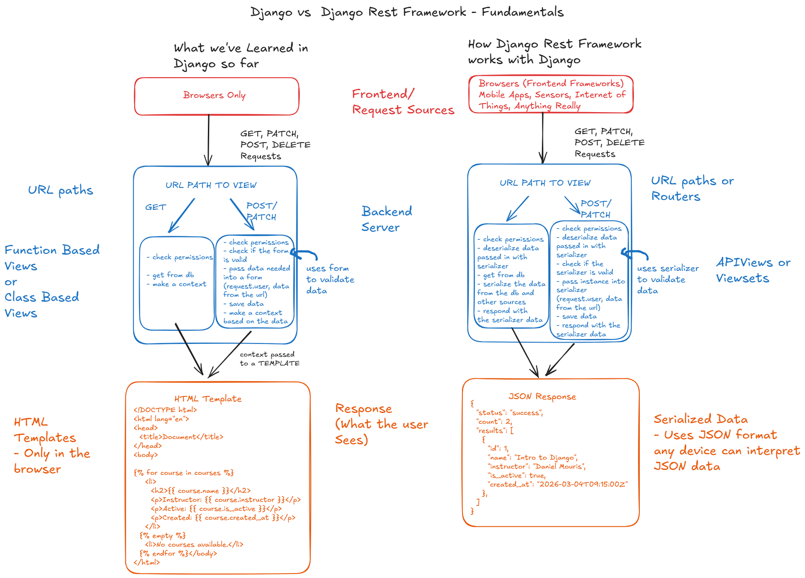
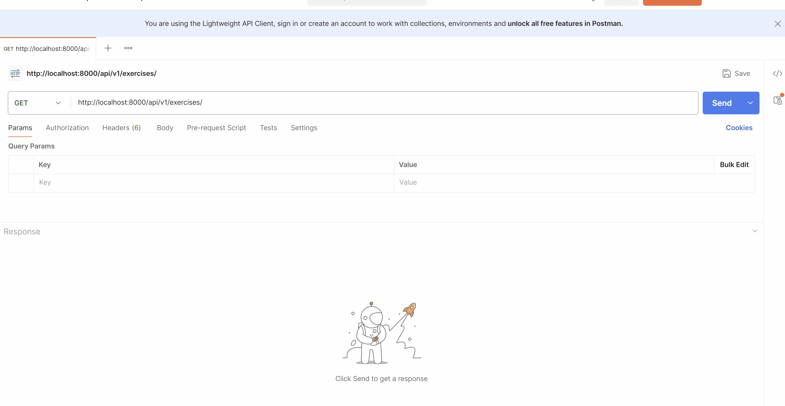
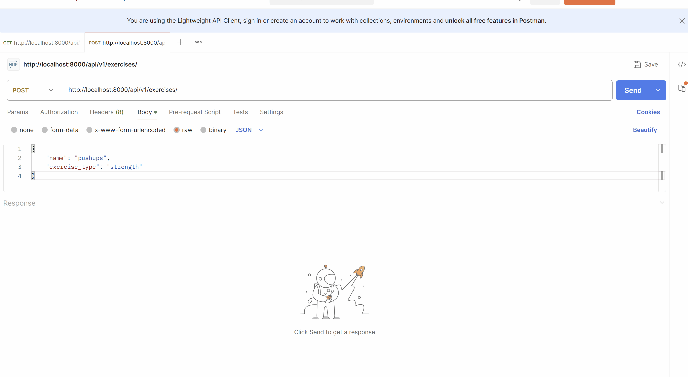
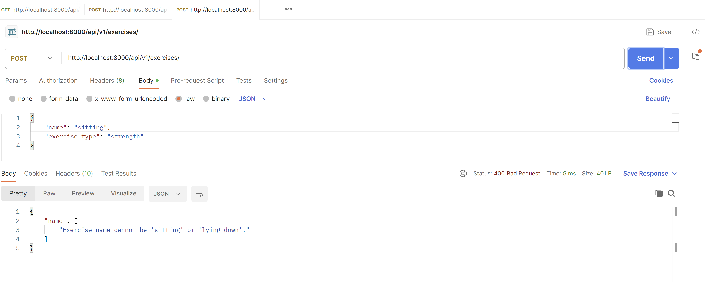
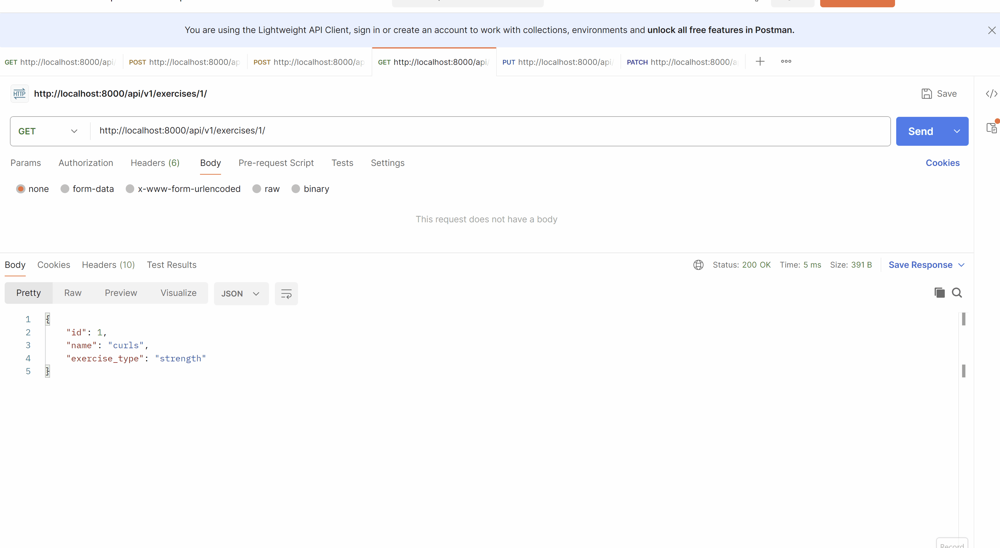

# Creating APIs with Django REST framework (DRF)

Django REST framework is a powerful and flexible toolkit for building Web APIs. In this lesson, we're going to build a REST API for workouts and exercises. We're going to create endpoints to list, create, retrieve, update, and delete workouts and exercises. We'll also implement authentication and permissions to secure our API.


## Prerequisites
- Create a new virtual environment and install the packages from the `requirements.txt` file.

## Steps

### 1. Let's talk about how to create a REST API with Django REST framework for our models and install and configure Django REST framework in our project.

#### 1.1 The fundamentals of REST API development with Django REST framework.
In our course so far, we've building views and templates to handle our data. Now we're going to create endpoint that can be consumed by frontend applications or other clients. We'll create serializers to convert our model instances to JSON format, and we'll create viewsets to handle the logic for our API endpoints.

We're going to be using [Django REST framework](https://www.django-rest-framework.org/) to create our API. Let's talk about the ideas behind REST APIs and how they relate to Django and what we've learned so far.

Serializers in Django REST framework are similar to Django forms and also act as a representation of the data.

APIViews and ViewSets in Django REST framework are similar to Django views. These are going to handle
the logic for our endpoints.

URL Routing in Django REST framework is similar to Django's URL routing, but it also provides some additional features to make it easier to create RESTful endpoints.



#### 1.2 Let's install and configure Django REST framework in our project.
To install Django REST framework, we can use pip:

```bash
pip install djangorestframework
```

In our `track_workout_projects/track_workout_projects/settings.py` file, we need to add `rest_framework` to our `INSTALLED_APPS`:

```python
INSTALLED_APPS = [
    "django.contrib.admin",
    "django.contrib.auth",
    "django.contrib.contenttypes",
    # ... other apps ...
    # third party apps
    "rest_framework",

    # custom apps
    "workouts_app",
]
```

Also in our `settings.py` file, we can add some default settings for Django REST framework:

```python
# ... all other settings ...

# Django REST framework settings
REST_FRAMEWORK = {
    # Use Django's standard `django.contrib.auth` permissions,
    # or allow read-only access for unauthenticated users.
    "DEFAULT_PERMISSION_CLASSES": [
        "rest_framework.permissions.DjangoModelPermissionsOrAnonReadOnly"
    ]
}
```

### 2. Let's take a look at the models we have in the `workouts_app`.

We have three models here:
- `Exercise`: Represents an exercise with a name and type (cardio, strength, flexibility, balance).
- `Workout`: Represents a workout with a title and date.
- `WorkoutLog`: Represents a log of a workout, linking a workout to an exercise with additional details like reps, weight, and time (depending on the exercise type).

### 3. Let's Create some `serializers` for our models.

Serializers in DRF do two things:
1. They convert complex data types, such as Django model instances, into native Python datatypes that can then be easily rendered into JSON, XML, or other content types.
2. They also provide deserialization, allowing parsed data to be converted back into complex types, after first validating the incoming data.

Let's create serializers for our `Exercise` model explicitly.

```python
from rest_framework import serializers

from .models import Exercise, Workout


class ExerciseSerializer(serializers.Serializer):
    id = serializers.IntegerField(read_only=True)
    name = serializers.CharField(max_length=100)
    exercise_type = serializers.ChoiceField(choices=Exercise.EXERCISE_TYPES)
```
Let's talk about what's going on here.
- We import the `serializers` module from `rest_framework`.
- We define a new serializer class `ExerciseSerializer` that inherits from `serializers.Serializer`.
- We define the fields that we want to serialize: `id`, `name`, and `exercise_type`. The `id` field is read-only because it will be automatically generated by the database.
- the `create` method is responsible for creating a new `Exercise` instance when we receive valid data. It uses the `validated_data` to create and return a new `Exercise` object.
  - the `validated_data` is the same as `cleaned_data` in Django forms. It contains the validated and deserialized data that we can use to create or update our model instances.
- the `update` method is responsible for updating an existing `Exercise` instance when we receive

### 4. Let's create a `get` endpoint for our `APIView` named `ExerciseAPIView` to handle the logic for our API endpoints related to exercises.

We need the view logic to handle `GET` requests to list all of the exercises in our database. We can use the `ExerciseSerializer` to serialize the data and return it as a JSON response.

```python

from rest_framework import APIView
from rest_framework.response import Response

from .serializers import ExerciseSerializer
from .models import Exercise


class ExerciseAPIView(APIView):
    def get(self, request):
        exercises = Exercise.objects.all()
        serializer = ExerciseSerializer(exercises, many=True)
        return Response(serializer.data)
```
Let's talk about what's going on here.
- We import the `APIView` class from `rest_framework.views` and the `Response` class from `rest_framework.response`.
- We define a new view class `ExerciseAPIView` that inherits from `APIView`.
- We define a `get` method that will handle `GET` requests to this endpoint.
- Inside the `get` method, we retrieve all `Exercise` instances from the database using `Exercise.objects.all()`.
- We then create an instance of `ExerciseSerializer`, passing in the queryset of exercises and setting `many=True` to indicate that we are serializing a list of objects.
- Finally, we return a `Response` object containing the serialized data, which will be rendered as JSON by default.

### 5. Let's set up our `urls.py` to route requests to our `ExerciseAPIView` and update our project `urls.py` to include the `workouts_app` URLs.


#### 5.1 In the workouts app directory/folder, create a new file named `urls.py` and add the following code to it:

```python
from .views import ExerciseAPIView

from django.urls import path

urlpatterns = [
    path('exercises/', ExerciseAPIView.as_view(), name='exercise-api'),
]
```
You can see here that this is the same as a class based view in Django, but instead of using `as_view()` to create a view function, we're using it to create an API view function that will handle requests to the `/exercises/` endpoint.

##### 5.2 Now, let's update our project `urls.py` to include the `workouts_app` URLs.

```python
from django.contrib import admin
from django.urls import path, include

urlpatterns = [
    path('admin/', admin.site.urls),
    path('api/v1/', include('workouts_app.urls')),
]
```
This will include the URLs from our `workouts_app` under the `/api/v1/` path. So, when we access `/api/v1/exercises/`, it will route to our `ExerciseAPIView` and return the list of exercises in JSON format.

Note: It's good practice to version your API endpoints (e.g., `v1`, `v2`) to allow for future changes without breaking existing clients.

### 6. Let's run our server, add some exercises through the Django admin, and test our API endpoint with Postman.

#### 6.1 setup db and run the project.
Let's make sure we follow the same steps as we've done in the course
- make the migrations
- apply the migrations
- create a superuser
- run the server
- add some exercises through the Django admin

#### 6.2 Test the API endpoint with Postman

Open postman and make a `GET` request to `http://localhost:8000/api/v1/exercises/`. You should see a JSON response with the list of exercises you added through the admin.
It should look like this:


Woo! You've created our first get endpoint with Django REST Framework!

Let's add the `POST`, `PUT`, `PATCH`, and `DELETE` methods to our `ExerciseAPIView` to allow us to create, update, and delete exercises through the API as well.


### 7. Let's add a `POST` method to our `ExerciseAPIView` to allow us to create new exercises through the API.

#### 7.1 Let's update our `ExerciseSerializer` to include a `create` method that will handle the logic for creating new `Exercise` instances when we receive valid data.

DRF uses the serializer to not only validate the data (similar to how forms work) but also to create new instances of the model when we receive valid data. We can use the `create` method of our serializer to handle this logic.

```python
from rest_framework import serializers

from .models import Exercise


class ExerciseSerializer(serializers.Serializer):
    id = serializers.IntegerField(read_only=True)
    name = serializers.CharField(max_length=100)
    exercise_type = serializers.ChoiceField(choices=Exercise.EXERCISE_TYPES)

    # added create method to handle the logic for creating new Exercise instances
    def create(self, validated_data):
        return Exercise.objects.create(**validated_data)
```

#### 7.2 Now, let's add a `post` method to our `ExerciseAPIView` to handle `POST` requests and create new exercises through the API.

```python
from rest_framework import APIView
from rest_framework.response import Response

from .serializers import ExerciseSerializer
from .models import Exercise

class ExerciseAPIView(APIView):
    # ... get request ...
    def post(self, request):
        serializer = ExerciseSerializer(data=request.data)
        if serializer.is_valid():
            exercise = serializer.save()
            return Response(ExerciseSerializer(exercise).data, status=201) # 201 Created indicates that the request was successful and a new resource was created as a result.
        return Response(serializer.errors, status=400) # 400 Bad Request indicates that the server cannot process the request due to a client error (e.g., validation errors).
```
Let's talk about what's going on here.
- We define a `post` method that will handle `POST` requests to this endpoint.
- Inside the `post` method, we create an instance of `ExerciseSerializer`, passing in the incoming data from the request (`request.data`).
- We check to see if the serializer is valid. If it is, we call `serializer.save()`, which will use the `create` method we defined in the serializer to create a new `Exercise` instance in the database.

#### 7.3 Now, let's test our `POST` endpoint with Postman.
Open Postman and make a `POST` request to `http://localhost:8000/api/v1/exercises/` with the following JSON body:

```json
{
    "name": "Push-up",
    "exercise_type": "strength"
}
```
it should look like this:


#### 7.4 Let's add some validation to our `ExerciseSerializer` to ensure that we only create exercises with valid data.

As you saw in the last step here our serializer is not only the representation of our data but is also our validation layer (just like plain old django forms). We can add custom validation to our serializer to ensure that we only create exercises with valid data.

Open `workouts_app/serializers.py` and add the following code to the `ExerciseSerializer`:

```python
from rest_framework import serializers

from .models import Exercise


class ExerciseSerializer(serializers.Serializer):
    id = serializers.IntegerField(read_only=True)
    name = serializers.CharField(max_length=100)
    exercise_type = serializers.ChoiceField(choices=Exercise.EXERCISE_TYPES)

    def validate_name(self, value):
        INVALID_EXERCISE_NAMES = ["sitting", "lying down"]
        if value in INVALID_EXERCISE_NAMES:
            raise serializers.ValidationError("Exercise name cannot be 'sitting' or 'lying down'.")
        return value

    def create(self, validated_data):
        return Exercise.objects.create(**validated_data)

```
Let's talk about what's going on here.
- We define a `validate_name` method that will be called automatically by the serializer when we validate the incoming data. This method checks if the exercise name is in a list of invalid names and raises a `ValidationError` if it is. If the name is valid, it returns the value.
  - You can see the parallels between this and the `clean_name` method we would define in a Django form to validate the name field.
- Now, if we try to create an exercise with the name "sitting" or "lying down" through our API, we will get a validation error.

#### 7.5 Let's test our validation with Postman.
Open Postman and make a `POST` request to `http://localhost:8000/api/v1/exercises/` with the following JSON body:

```json
{
    "name": "sitting",
    "exercise_type": "cardio"
}
```
You should see the following:


### 8. Let's add the `PUT`, and `PATCH` methods to our `ExerciseAPIView` to allow us to update existing exercises through the API, and the `GET` method to retrieve a single exercise by its ID.

#### 8.1 Let's talk about the detail view for our `ExerciseAPIView`.
Let's modify our `get` method to handle both listing all exercises and retrieving a single exercise by its ID. We can check if an `id` parameter is provided in the URL and return the appropriate response.

```python
from django.shortcuts import get_object_or_404
from rest_framework.views import APIView
from rest_framework.response import Response

from .serializers import ExerciseSerializer
from .models import Exercise

class ExerciseAPIView(APIView):
    def get(self, request, id=None):
        # detail view
        if id:
            exercise = get_object_or_404(Exercise, id=id)
            serializer = ExerciseSerializer(exercise)
            return Response(serializer.data)
        # list view
        exercises = Exercise.objects.all()
        serializer = ExerciseSerializer(exercises, many=True)
        return Response(serializer.data)

    # ... post method ...
```

#### 8.2 Let's talk about the detail view url for our `ExerciseAPIView` (this will also be used for the `PUT`, `PATCH`, and `DELETE` methods).

We need to update our `urls.py` to include a URL pattern for the detail view of our `ExerciseAPIView`. This will allow us to access a single exercise by its ID and also use the same URL for updating and deleting exercises.

```python
from .views import ExerciseAPIView
from django.urls import path

urlpatterns = [
    path('exercises/', ExerciseAPIView.as_view(), name='exercise-list'),
    # note we're still adding the same ExerciseAPIView but we're passing in an id parameter to the URL pattern
    path('exercises/<int:id>/', ExerciseAPIView.as_view(), name='exercise-detail'),
]
```

#### 8.3 Let's update our `ExerciseSerializer` to include an `update` method that will handle the logic for updating existing `Exercise` instances when we receive valid data.

```python
from rest_framework import serializers

from .models import Exercise


class ExerciseSerializer(serializers.Serializer):
    id = serializers.IntegerField(read_only=True)
    name = serializers.CharField(max_length=100)
    exercise_type = serializers.ChoiceField(choices=Exercise.EXERCISE_TYPES)

    # ... validate_name and create methods ...

    # added update method to handle the logic for updating existing Exercise instances
    def update(self, instance, validated_data):
        instance.name = validated_data.get('name', instance.name)
        instance.exercise_type = validated_data.get('exercise_type', instance.exercise_type)
        instance.save()
        return instance
```
This `update` method takes in the existing `Exercise` instance and the validated data from the request. It updates the fields of the instance with the new data (or keeps the old data if no new data is provided) and saves the instance to the database.

#### 8.4 Let's add the `PUT` and `PATCH` methods to our `ExerciseAPIView` to allow us to update existing exercises through the API.

Let's add `put` and `patch` methods to our `ExerciseAPIView` to handle `PUT` and `PATCH` requests for updating existing exercises. We can use the same logic for both methods, but we will pass in a `partial` argument to indicate whether this is a full update (PUT) or a partial update (PATCH).

```python
from django.shortcuts import get_object_or_404
from rest_framework import serializers
from .models import Exercise

class ExerciseAPIView(APIView):

    # ... get and post methods ...

    # let's add a function that will update the existing exercise instance when we receive valid data
    def update(self, request, id, partial=False):
        exercise = get_object_or_404(Exercise, id=id)
        serializer = ExerciseSerializer(exercise, data=request.data, partial=partial)
        if serializer.is_valid():
            exercise = serializer.save()
            return Response(ExerciseSerializer(exercise).data) # 200 OK indicates that the request was successful and the response contains the updated exercise data.
        return Response(serializer.errors, status=400) # 400 Bad Request indicates that the server cannot process the request due to a client error (e.g., validation errors).

    # we can use the same update function for both PUT and PATCH requests by passing in the partial argument
    def put(self, request, id):
        return self.update(request, id, partial=False)

    def patch(self, request, id):
        return self.update(request, id, partial=True)
```
Let's talk about what's going on here.
- We define an `update` method that will handle the logic for updating an existing `Exercise` instance. It takes in the request, the ID of the exercise to update, and a `partial` argument that indicates whether this is a partial update (PATCH) or a full update (PUT).
- Inside the `update` method, we first retrieve the existing `Exercise` instance using `get_object_or_404`. We then create an instance of `ExerciseSerializer`, passing in the existing exercise instance, the incoming data from the request, and the `partial` argument.
- We check to see if the serializer is valid. If it is, we call `serializer.save()`, which will use the `update` method we defined in the serializer to update the existing `Exercise` instance in the database. We then return a `Response` object containing the updated exercise data.
- We define the `put` and `patch` methods to call the `update` method with the appropriate `partial` argument.
  - The `put` method is for full updates, where the client must provide all fields of the exercise. If any fields are missing, they will be set to null or default values.
  - The `patch` method is for partial updates, where the client can provide only the fields they want to update. Any fields that are not provided will remain unchanged.

#### 8.4 Let's test our `GET`, `PUT` and `PATCH` endpoints with Postman.

Let's take a look at the detail view with get and using the put (full update) and patch (partial update) methods to update an existing exercise.

**IMPORTANT NOTE** you'll always need to put the trailing slash at the end of the url.



### 9. Let's add the `DELETE` method to our `ExerciseAPIView` to allow us to delete existing exercises through the API.

The delete request is the simplest of all of them. We just need to retrieve the existing `Exercise` instance and call the `delete` method on it.

We don't have to do any additional work in our serializer for the delete method since we're not creating or updating any instances, we're just deleting an existing instance.

```python
from django.shortcuts import get_object_or_404
from rest_framework import serializers
from .models import Exercise


class ExerciseAPIView(APIView):

    # ... get, post, and update methods ...

    def delete(self, request, id):
        exercise = get_object_or_404(Exercise, id=id)
        exercise.delete()
        return Response(status=204) # 204 No Content indicates that the request was successful but there is no content to return in the response.

```

You can test the delete endpoint with Postman by making a `DELETE` request to `http://localhost:8000/api/v1/exercises/<id>/`, replacing `<id>` with the ID of the exercise you want to delete.

## Challenge/Exercise

### Add Goals to our workout tracker API
Add a model called `Goal` to the `workouts_app` with the following fields:
- `title`: CharField with max length of 100
- `description`: TextField
- `target_date`: DateField

Create a serializer for the `Goal` model and add an API view to handle `GET`, `POST`, `PUT`, `PATCH`, and `DELETE` requests for goals. Update the URLs to include the new endpoints for goals.

Create an APIView called `GoalAPIView` that will handle the logic for our API endpoints related to goals. Implement the necessary methods to allow clients to create, retrieve, update, and delete goals through the API.

Add the necessary URL patterns to route requests to the `GoalAPIView` for both listing all goals and retrieving a single goal by its ID.

Test it in Postman!


## Conclusion

In this lesson we learned the fundamentals of creating a REST API with Django REST framework. We created serializers to convert our model instances to JSON format, and we created API views to handle the logic for our API endpoints. We also implemented validation in our serializers to ensure that we only create and update exercises with valid data. Finally, we tested our API endpoints with Postman to ensure that they are working correctly.
