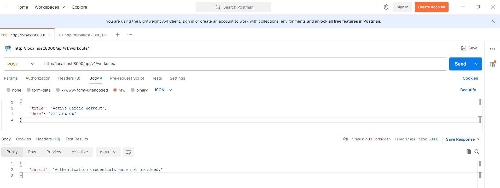
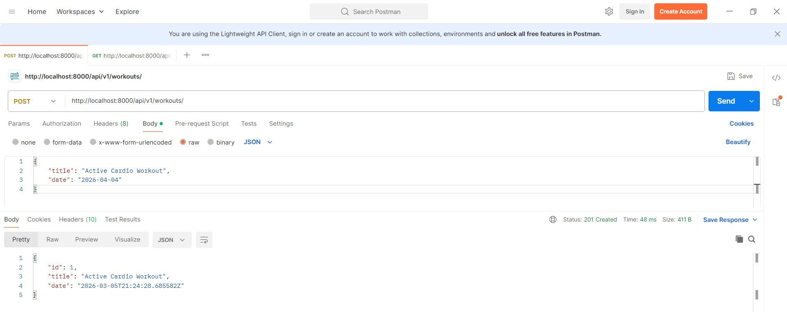
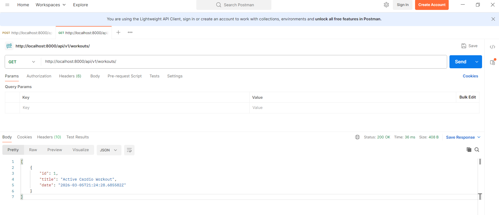
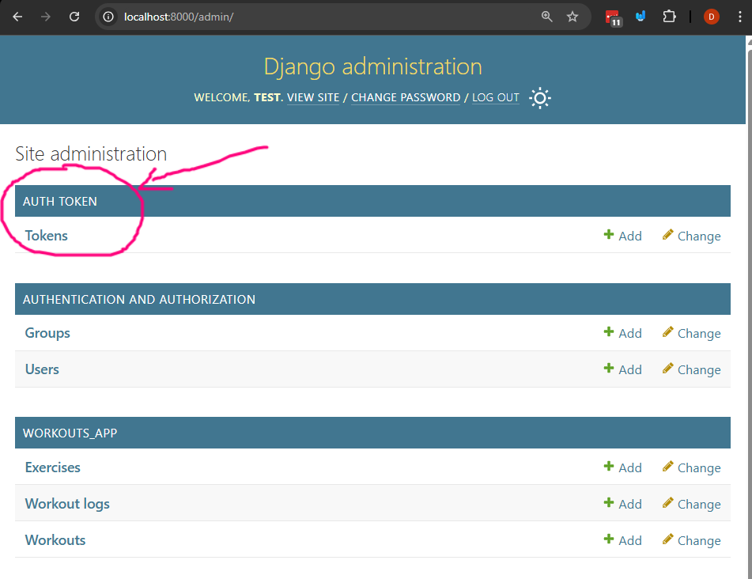
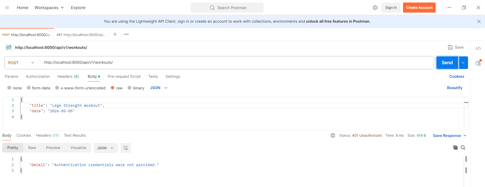
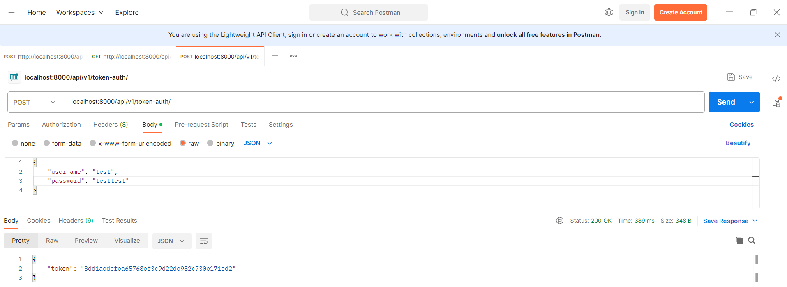
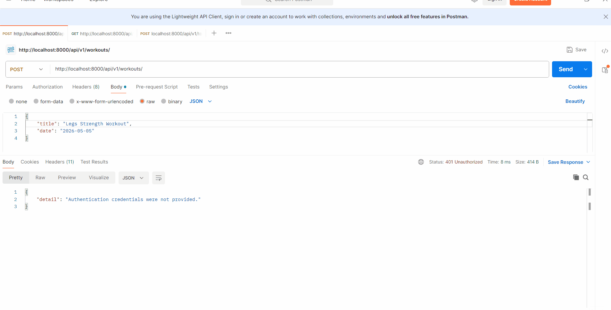

# DRF APIs with ModelSerializers, Viewsets, Permissions, Authentication, and Token based authentication

Here we're going to simplify the process of creating APIs by using the concept of ModelSerializers, Viewsets, and Routers. We'll also implement permissions, authentication, and token-based authentication to secure our APIs.

We're going to do this by modifying the existing project to serialize the "Workout" model and create API endpoints for it. We'll also set up permissions to restrict access to authenticated users and implement token-based authentication.

## Prerequisites
- Create a new virtual environment and install the packages from the `requirements.txt` file.

## Steps

### 1. Let's Create a `WorkoutSerializer` in `serializers.py` that uses a `ModelSerializer` to serialize the `Workout` model.

A `ModelSerializer` is a shortcut (kind of like a `ModelForm`) except it automatically generates a set of fields based on the model and also includes simple implementations of the `create()` and `update()` methods. This makes it easier to create serializers for our models without having to define each field manually.

Open `workout/serializers.py` and add the following code:

```python
from rest_framework import serializers
from .models import Exercise, Workout

class WorkoutSerializer(serializers.ModelSerializer):
    class Meta:
        model = Workout
        fields = '__all__'
        # you could also specify fields like this:
        # fields = ['id', 'title', 'date']

# ... ExerciseSerializer remains unchanged ...
```
Let's talk about what this code does:
- We import the `serializers` module from `rest_framework` and the `Workout` model from our app's `models.py`.
- We define a new class `WorkoutSerializer` that inherits from `serializers.ModelSerializer`.
- Inside the `Meta` class, we specify
- the model we want to serialize (`Workout`) and the fields we want to include in the serialization. By using `fields = '__all__'`, we are telling DRF to include all fields from the `Workout` model in the serialized output.
  - Note here that the `id` field will be read-only by default since it's an auto-generated primary key, so we don't need to worry about it being included in the `fields` list when we create or update a workout.

Note: this creates all of the fields for the `WorkoutSerializer` based on the `Workout` model, so if you add new fields to the model in the future, they will automatically be included in the serializer as well. This creates all of the fields automatically for the `Workout` model that we explicitly set for the `ExerciseSerializer`.

### 2. Next, let's create a `WorkoutViewSet` in `views.py` that uses a `ModelViewSet` to provide CRUD operations for the `Workout` model.

Last class we used an `APIView` to create our endpoints but now we're going to use a `ModelViewSet` which provides a set of default views for listing, creating, retrieving, updating, and deleting objects. This will allow us to quickly create API endpoints for our `Workout` model without having to define each view manually.

Open `workout/views.py` and add the following code:

```python

from django.shortcuts import get_object_or_404
from rest_framework.views import APIView
from rest_framework import viewsets
from rest_framework.response import Response

from .serializers import ExerciseSerializer, WorkoutSerializer
from .models import Exercise, Workout


class WorkoutViewSet(viewsets.ModelViewSet):
    queryset = Workout.objects.all()
    serializer_class = WorkoutSerializer
```
Now let's talk about what this code does:
- We import the necessary modules and classes from Django and DRF.
- We define a new class `WorkoutViewSet` that inherits from `viewsets.ModelViewSet`.
- We set the `queryset` attribute to `Workout.objects.all()`, which tells DRF to use all `Workout` objects as the data source for this viewset.
  - We'll talk about `querysets` a bit more in detail in the next example but for now this is just getting all of the


Let's take a look at documentation for a `ModelViewSet` to see what it provides for us:
- `list()`: GET request to list all objects (e.g., `/workouts/`)
- `create()`: POST request to create a new object (e.g., `/workouts/`)
- `retrieve()`: GET request to retrieve a specific object by ID (e.g., `/workouts/1/`)
- `update()`: PUT request to update a specific object by ID (e.g., `/workouts/1/`)
- `partial_update()`: PATCH request to partially update a specific object by ID (e.g., `/workouts/1/`)
- `destroy()`: DELETE request to delete a specific object by ID (e.g., `/workouts/1/`)

this drastically shortens up the code we wrote last class, and if we need to add any custom behavior to these views, we can simply override the corresponding methods in our `WorkoutViewSet` class.

[Here's the docs to viewsets](https://www.django-rest-framework.org/api-guide/viewsets/#modelviewset) for more information on what they provide and how to use them.

### 3. Let's set up our URLs to use the `WorkoutViewSet` with a router.

Last class we explicitly defined our URL patterns for each view, but now that we're using a `ModelViewSet`, we can take advantage of DRF's routers to automatically generate the URL patterns for us.

Open `workout/urls.py` and modify it to look like this:

```python
from django.urls import path, include
from rest_framework.routers import DefaultRouter
from .views import ExerciseAPIView, WorkoutViewSet

router = DefaultRouter()

router.register(r'workouts', WorkoutViewSet)

urlpatterns = [

    path('exercises/', ExerciseAPIView.as_view(), name='exercise-api'),
    path('exercises/<int:id>/', ExerciseAPIView.as_view(), name='exercise-detail'),
] + router.urls

```
Let's break down what this code does:
- We import the necessary modules and classes from Django and DRF.
- We create a new instance of `DefaultRouter` which will automatically generate URL patterns for our viewsets.
- We register our `WorkoutViewSet` with the router using the `register()` method. The first argument is the prefix for the URL (in this case, 'workouts'), and the second argument is the viewset class.
- Finally, we include the router's URLs in our `urlpatterns` list. This will add the necessary URL patterns for our `WorkoutViewSet` to handle CRUD operations.

Let's take a look at the generated URL patterns for our `WorkoutViewSet`:
- `GET /workouts/`: List all workouts
- `POST /workouts/`: Create a new workout
- `GET /workouts/{id}/`: Retrieve a specific workout by ID
- `PUT /workouts/{id}/`: Update a specific workout by ID
- `PATCH /workouts/{id}/`: Partially update a specific workout by ID
- `DELETE /workouts/{id}/`: Delete a specific workout by ID

Let's take a look at this in action by running a development server and testing our API endpoints for the `POST` and `GET` requests to the `/workouts/` endpoint.

### 4. Let's test our API endpoints for the `Workout` model and begin talking about permissions and authentication.


#### 4.1 Testing the `POST /workouts/` endpoint permission denied.
Right now if we create a workout using the `POST /workouts/` it will give us an error because we haven't set up permissions or authentication yet. By default, DRF's viewsets require authentication to access the endpoints, so we need to set up some form of authentication before we can test our API. This is shown here:



#### 4.1 Let's set up permissions to allow any user to access the `WorkoutViewSet` endpoints.
Open `workout/views.py` and modify the `WorkoutViewSet` to include the following line:

```python
# ... other imports ...

class WorkoutViewSet(viewsets.ModelViewSet):
    permission_classes = []  # Allow any user to access these endpoints
    queryset = Workout.objects.all()
    serializer_class = WorkoutSerializer
```

By setting `permission_classes` to an empty list, we are allowing any user (authenticated or not) to access the endpoints provided by the `WorkoutViewSet`. This means that now we should be able to successfully create a workout using the `POST /workouts/` endpoint without any authentication, we'll fix this in the upcoming steps.

Now if we try to create a workout again using the `POST /workouts/` endpoint, it should work successfully:



#### 4.2 Testing the `GET /workouts/` endpoint to list all workouts.

Now that we have successfully created a workout, we can test the `GET /workouts/` endpoint to see if it returns the list of workouts. If we send a GET request to `/workouts/`, we should see a response that includes the workout we just created:


### 5. Let's set up simple token-based authentication to secure our API endpoints.

In this course so far we've used session based authentication. For APIs, it's often more common to use token-based authentication, which allows clients to authenticate using a token instead of a username and password. This is especially useful for mobile applications or third-party clients that need to access our API.

Tokens are a list of characters generated by the server that any client (mobile app, frontend app or even a third-party service) can use to authenticate with the server. The client sends the token in the header of each request, and the server verifies the token to authenticate the client.

We'll be talking about the different types of tokens but we're going to use the simplest form of token-based authentication provided by DRF, which is the `TokenAuthentication` class. This will allow us to generate tokens for our users and use those tokens to authenticate requests to our API endpoints.

#### 5.1 Let's setup our project to use token-based authentication.

In settings.py, add the following lines to the `INSTALLED_APPS` and `REST_FRAMEWORK` settings:

```python
# ... other settings ...
INSTALLED_APPS = [
    # ... other apps ...
    'rest_framework.authtoken',  # Add this line to include the token authentication app
    # ... custom apps ...
]
```
This creates a new `Token` model that we'll use to store the authentication tokens for our users. Next, we need to run the migrations to create the necessary database tables for the `Token` model
```bash
python manage.py migrate
```

If you go to the admin panel, you should now see a new section for "Tokens" where you can create tokens for your users as shown below:


Let's also setup the default authentication classes in our `settings.py` to use token-based authentication for our API endpoints. Add the following lines to your `REST_FRAMEWORK` settings:

```python

REST_FRAMEWORK = {
    'DEFAULT_AUTHENTICATION_CLASSES': [
        'rest_framework.authentication.TokenAuthentication',  # Use token-based authentication
    ],
    # below is already here.
    "DEFAULT_PERMISSION_CLASSES": [
        "rest_framework.permissions.DjangoModelPermissionsOrAnonReadOnly"
    ]
}
```

#### 5.2 Let's add urls for the user to obtain a auth token.

To allow users to obtain an authentication token, we need to add a URL pattern that points to the `obtain_auth_token` view provided by DRF. This view will handle the process of validating the user's credentials and returning a token if the credentials are valid.

Open your project's main `urls.py` file and add the following import and URL pattern:

```python
# ... other imports ...
from rest_framework.authtoken.views import obtain_auth_token

urlpatterns = [
    # ... other url patterns ...
    path('api/v1/token-auth/', obtain_auth_token, name='api_token_auth'),  # Add this line to
]
```

#### 5.3 Let's add some permissions to our `WorkoutViewSet` to restrict access to authenticated users only.

In the `views.py` file, modify the `WorkoutViewSet` to include the following line:

```python
from rest_framework.permissions import IsAuthenticated

# ... other imports ...

class WorkoutViewSet(viewsets.ModelViewSet):
    permission_classes = [IsAuthenticated]  # Restrict access to authenticated users only
    queryset = Workout.objects.all()
    serializer_class = WorkoutSerializer

# ... ExerciseAPIView remains unchanged ...
```

By setting `permission_classes` to `[IsAuthenticated]`, we are restricting access to the endpoints provided by the `WorkoutViewSet` to authenticated users only. This means that now if we try to access the `POST /workouts/` endpoint without providing a valid token, we should receive a permission denied error.

#### 5.4 Let's test our API endpoints again to see the effect of the new permissions and authentication.

Let's first try to access the `POST /workouts/` endpoint without providing a token. We should see a permission denied error as shown below:


Let's now obtain a token for our "test" user by sending a POST request to the `/api/v1/token-auth/` endpoint with the user's credentials. We should receive a token in the response as shown below:


You'll need to keep this token handy because we're going to use it to authenticate our requests to the `WorkoutViewSet` endpoints. Now let's try to access the `POST /workouts/` endpoint again, but this time we'll include the token in the Authorization header of our request. We should now be able to successfully create a workout as shown below:


**IMPORTANT NOTE**: When testing authenticated endpoints, make sure to include the token in the Authorization header of your requests. The header should look like this:
```
Authorization: Token your_token_here
```
This tells the server that you are authenticating using a token and allows you to access the protected endpoints.

#### 5.5 Let's talk about different types of tokens.

In this course, we're going to use the simplest form of token-based authentication provided by DRF, which is the `TokenAuthentication` class. However, there are other types of tokens that you can use for authentication in DRF, such as JSON Web Tokens (JWT) and OAuth2 tokens that are more secure and have additional features like token expiration and refresh tokens. These types of tokens are often used in production applications to provide a more secure authentication mechanism.

Your authorization will look something like this when using JWT or OAuth2 tokens in your header.
```
Authorization: Bearer your_token_here
```

Good projects to check out for JWT and OAuth2 authentication in DRF:
- [djangorestframework-simplejwt](https://github.com/jazzband/djangorestframework-simplejwt)
- [django-oauth-toolkit](https://github.com/django-oauth/django-oauth-toolkit)


## Challenge/Exercise

Build on the "Goal" endpoint we created in the previous class and create a new `GoalSerializer` and `GoalViewSet` to provide API endpoints for the `Goal` model. Set up permissions to allow only authenticated users to access the `GoalViewSet` endpoints, and test your API endpoints using token-based authentication.


## Conclusion

In this class, we learned how to use DRF's `ModelSerializer` and `ModelViewSet` to quickly create API endpoints for our models. We also set up permissions to restrict access to authenticated users and implemented token-based authentication to secure our API endpoints. This is a common pattern for building APIs in Django REST Framework, and it allows us to easily create and manage our API endpoints while ensuring that they are secure and accessible only to authorized users.

In the next class we're going to explore how to save the user who created a workout and restrict access to workouts so that users can only see and manage their own workouts. This will involve using the `request.user` object to associate workouts with the authenticated user and implementing custom permissions to enforce this behavior.
