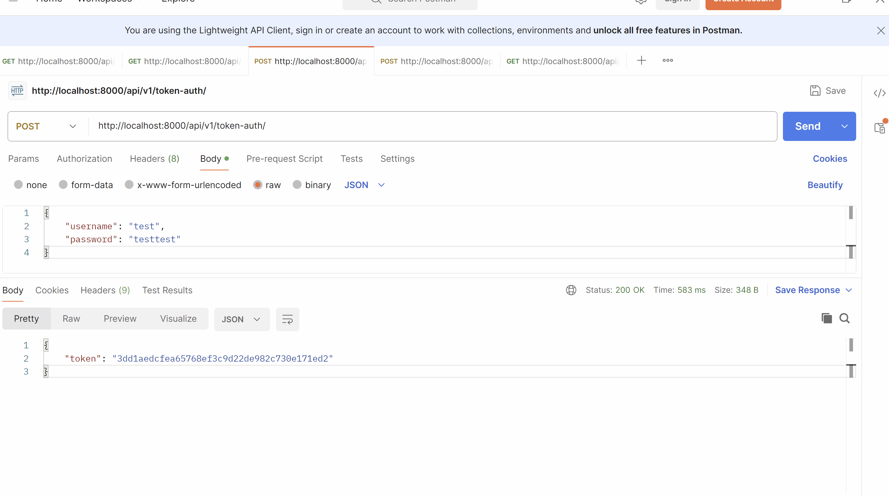
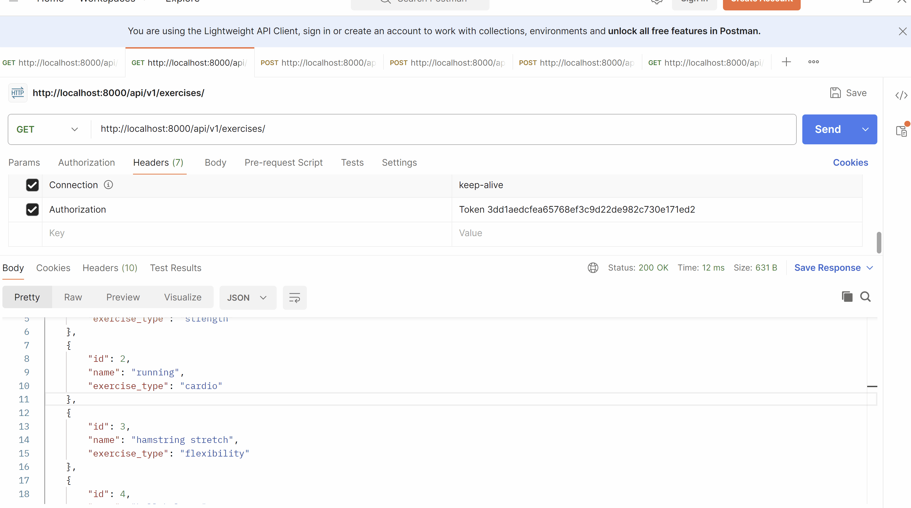
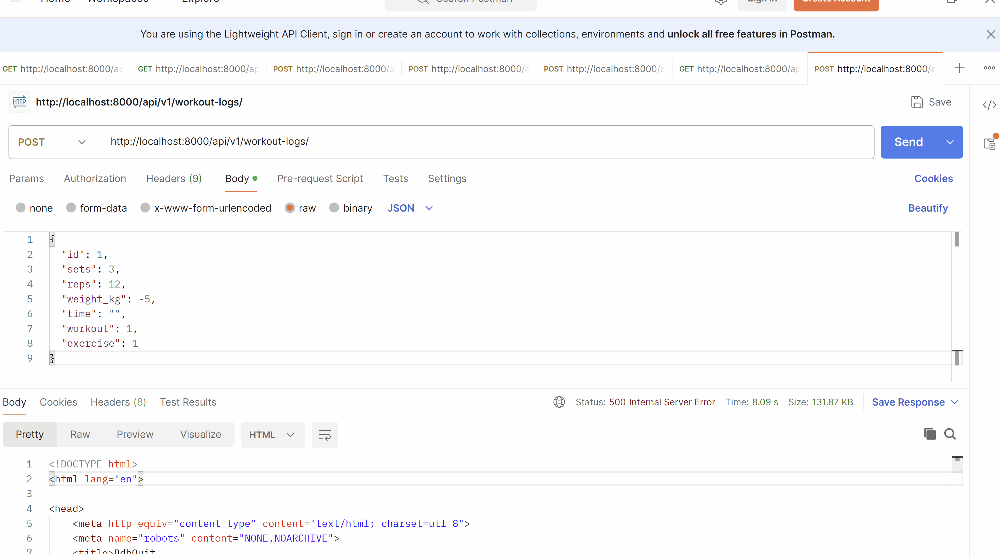
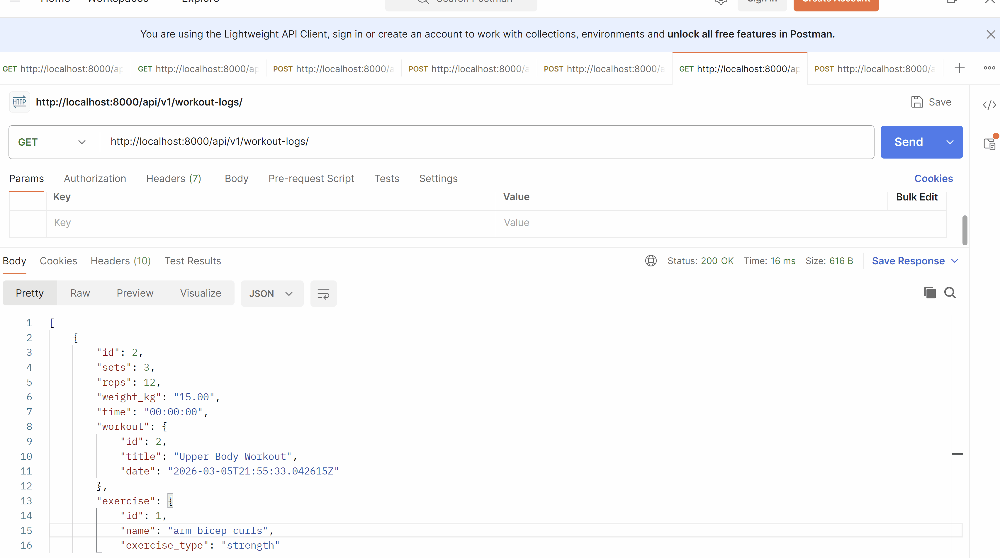
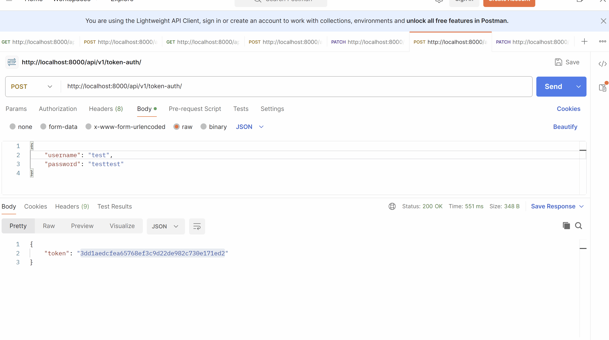

# DRF APIs with more Auth, more Permissions and User associated data.


## Prerequisites
- Create a new virtual environment and install the packages from the `requirements.txt` file.

## Steps

So far we've covered how to create a simple REST API with one model in DRF. Let's talk about using multiple models in our serializers and some different techniques to do so.

### 1. Let's Create two separate serializers for the workoutlog model - one for creating/updating workouts that doesn't include the user field and one for viewing workouts that includes the user field. This is a common pattern in DRF to have different serializers for different actions.

When you have a model that has a foreign key to the user model, you often want to have different serializers for creating/updating and viewing the data. This is because when creating/updating, you don't want the user to have to include the user field in the request body, but when viewing, you want to include the user's information in the response.

#### 1.1 Let's create the ReadOnly serializer for the workoutlog model that includes the user field in the `workouts_app/serializers.py` file.

In a serializer you can use other serializer to include related data in the response. In this case we're using the WorkoutSerializer and ExerciseSerializer to include the workout's information and the exercises in the workout log in the response when viewing workouts. We set `read_only=True` on these fields because we don't want the user to be able to create/update these fields when creating/updating a workout log.

```python
from rest_framework import serializers
from .models import Workout, Exercise, WorkoutLog

# ... other serializers ...

class WorkoutLogReadOnlySerializer(serializers.ModelSerializer):
    # include the workout's information in the response
    workout = WorkoutSerializer(read_only=True)
    # include the exercises in the workout log
    exercise = ExerciseSerializer(read_only=True)

    class Meta:
        model = WorkoutLog
        fields = [
            'id',
            'sets',
            'reps',
            'weight_kg',
            'time',
            # override the default
            'workout',
            'exercise'
        ]
```
Let's talk about what's going on here.
- We're creating a new serializer called `WorkoutLogReadOnlySerializer` that inherits from `serializers.ModelSerializer`.
- We're including the workout's information in the response by using the `WorkoutSerializer` and setting `read_only=True` on the field. This means that when we serialize a workout log, it will include the workout's information in the response, but when we create/update a workout log, we won't be able to include the workout's information in the request body.
- We're including the exercises in the workout log by using the `ExerciseSerializer` and setting `read_only=True` on the field. This means that when we serialize a workout log, it will include the exercises in the workout log in the response, but when we create/update a workout log, we won't be able to include the exercises in the request body.

#### 1.2 Let's create the Create/Update serializer for the workoutlog model that doesn't include the user field in the `workouts_app/serializers.py` file.

In this field we are just going to include the workout and exercises as primary key related fields. This means that when creating/updating a workout log, the user will just include the workout's id and the exercises' ids in the request body.

```python
from rest_framework import serializers
from .models import Workout, Exercise, WorkoutLog

# ... other serializers ...
class WorkoutLogCreateUpdateSerializer(serializers.ModelSerializer):
    class Meta:
        model = WorkoutLog
        fields = [
            'id',
            'sets',
            'reps',
            'weight_kg',
            'time',
            # foreign key fields
            'workout',
            'exercise'
        ]
```
Let's talk about what's going on here.
- We're creating a new serializer called `WorkoutLogCreateUpdateSerializer` that inherits from `serializers.ModelSerializer`.
- We're including the workout and exercises as primary key related fields. This means that when we serialize a workout log, it will include the workout's id and the exercises' ids in the response, and when we create/update a workout log, we will include the workout's id and the exercises' ids in the request body.

### 2. Let's create the APIViews for the work out log model that use the different serializers for different actions.

#### 2.1 Let's create the `get_serializer_class` method in the WorkoutLogViewSet that returns the appropriate serializer based on the action in the `workouts_app/views.py` file.

```python
from .serializers import( ExerciseSerializer, WorkoutSerializer
                         , WorkoutLogReadOnlySerializer, WorkoutLogCreateUpdateSerializer)
from .models import Exercise, Workout
from rest_framework import viewsets
# ... other imports ...

# ... other api views and viewsets ...
class WorkoutLogAPIView(APIView):
    permission_classes = [IsAuthenticated]
    def get_serializer_class(self):
        if self.request.method in ['POST', 'PUT', 'PATCH']:
            return WorkoutLogCreateUpdateSerializer
        return WorkoutLogReadOnlySerializer

```

This method is called by DRF to determine which serializer to use for a given request. In this case, we're checking the HTTP method of the request and returning the appropriate serializer based on whether it's a create/update action (POST, PUT, PATCH) or a read action (GET).

We'll be using this `get_serializer_class` method in our WorkoutLogAPIView to determine which serializer to use for each action.

Important note: we're also adding a permission class to the view to require authentication for all actions on the workout log API. This means that only authenticated users will be able to create/update/view workout logs.

#### 2.2 Let's create the `get` method in the WorkoutLogAPIView that uses the `WorkoutLogReadOnlySerializer` to return the workout logs in the `workouts_app/views.py` file.

```python
# ... other imports and viewsets...

class WorkoutLogAPIView(APIView):
    permission_classes = [IsAuthenticated]
    def get_serializer_class(self):
        if self.request.method in ['POST', 'PUT', 'PATCH']:
            return WorkoutLogCreateUpdateSerializer
        return WorkoutLogReadOnlySerializer

    def get(self, request, id=None):
        # detail view
        if id:
            workout_log = get_object_or_404(WorkoutLog, id=id)
            serializer = self.get_serializer_class()(workout_log)
            return Response(serializer.data)
        # list view
        workout_logs = WorkoutLog.objects.all()
        serializer = self.get_serializer_class()(workout_logs, many=True)
        return Response(serializer.data)
```
Let's talk about what's going on here.
- We're defining a `get` method that takes in a request and an optional id parameter. If the id parameter is provided, we're treating this as a detail view and returning a single workout log. If the id parameter is not provided, we're treating this as a list view and returning all workout logs.
- We're using the `get_serializer_class` method to determine which serializer to use for the response. In this case, since this is a GET request, it will return the `WorkoutLogReadOnlySerializer`, which includes the workout's information and the exercises in the workout log in the response.
- We're serializing the workout log(s) and returning the serialized data in the response.


#### 2.3 Let's create the `post` method in the WorkoutLogAPIView that uses the `WorkoutLogCreateUpdateSerializer` to create a new workout log in the `workouts_app/views.py` file.

```python
# ... other imports and viewsets...

class WorkoutLogAPIView(APIView):
    permission_classes = [IsAuthenticated]
    def get_serializer_class(self):
        if self.request.method in ['POST', 'PUT', 'PATCH']:
            return WorkoutLogCreateUpdateSerializer
        return WorkoutLogReadOnlySerializer

    # ... get method ...

    def post(self, request):
        # get the serializer class based on the request method
        serializer = self.get_serializer_class()(data=request.data)
        if serializer.is_valid():
            workout_log = serializer.save()
            # return the workout log with the read only serializer to include the workout and exercise information in the response
            return Response(WorkoutLogReadOnlySerializer(workout_log).data, status=201)
        return Response(serializer.errors, status=400)
```
Let's talk about what's going on here.
- We're defining a `post` method that takes in a request. This method will be used to create a new workout log.
- We're using the `get_serializer_class` method to determine which serializer to use for the request. In this case, since this is a POST request, it will return the `WorkoutLogCreateUpdateSerializer`, which includes the workout and exercises as primary key related fields.
- We're validating the serializer and saving the workout log if the data is valid. If the data is not valid, we're returning the errors in the response with a 400 status code.
- After saving the workout log, we're returning the workout log in the response using the `WorkoutLogReadOnlySerializer` to include the workout's information and the exercises in the workout log in the response. We're also setting the status code to 201 to indicate that a new resource was created.
  - This is a common pattern in DRF to use a different serializer for the response than the one used for the request when creating/updating a resource. This allows us to include related data in the response that we don't want to include in the request body when creating/updating the resource.

#### 2.4 Let's create the `put` and `patch` methods in the WorkoutLogAPIView that use the `WorkoutLogCreateUpdateSerializer` to update an existing workout log in the `workouts_app/views.py` file.

```python
# ... other imports and viewsets ...

class WorkoutLogAPIView(APIView):
    permission_classes = [IsAuthenticated]
    def get_serializer_class(self):
        if self.request.method in ['POST', 'PUT', 'PATCH']:
            return WorkoutLogCreateUpdateSerializer
        return WorkoutLogReadOnlySerializer

    # ... get and post methods ...

    def update(self, request, id, partial=False):
        workout_log = get_object_or_404(WorkoutLog, id=id)
        serializer = self.get_serializer_class()(workout_log, data=request.data, partial=partial)
        if serializer.is_valid():
            workout_log = serializer.save()
            return Response(WorkoutLogReadOnlySerializer(workout_log).data)
        return Response(serializer.errors, status=400)

    def put(self, request, id):
        return self.update(request, id, partial=False)

    def patch(self, request, id):
        return self.update(request, id, partial=True)
```
Let's talk about what's going on here.
- We're defining an `update` method that takes in a request, an id, and a partial flag. This method will be used to update an existing workout log. The `partial` flag indicates whether this is a partial update (PATCH) or a full update (PUT).
- We're using the `get_serializer_class` method to determine which serializer to use for the request
- We're validating the serializer and saving the workout log if the data is valid. If the data is not valid, we're returning the errors in the response with a 400 status code.
- After saving the workout log, we're returning the workout log in the response using the `WorkoutLogReadOnlySerializer` to include the workout's information and the exercises in the workout log in the response.
- We're defining the `put` and `patch` methods that call the `update` method with the appropriate `partial` flag based on whether it's a PUT or PATCH request.

### 3. Let's add the urls for the WorkoutLogAPIView in the `workouts_app/urls.py` file.

```python
from .views import ExerciseAPIView, WorkoutViewSet, WorkoutLogAPIView

# ... other imports ...

# ... router setup ...
urlpatterns = [
    path('workout-logs/', WorkoutLogAPIView.as_view(), name='workout-log-api'),
    path('workout-logs/<int:id>/', WorkoutLogAPIView.as_view(), name='workout-log-detail'),
    # ... exercise urls ...
] + router.urls

```
Just like we did for the `ExerciseAPIView` we add the two paths so that we can have the detail views.

### 4. Let's test our API using Postman or a similar tool to make sure everything is working as expected.

#### 4.1 Let's do the post request and see the get request to see the data that we created.

Obtain the token for the user using `http://localhost:8000/api/v1/token-auth/` and include the token in the `Authorization` header of the request as a `Token tokenvaluehere`.

Let's make a POST request to `http://localhost:8000/api/v1/workout-logs/` with the following JSON body to create a new workout log.

So we're going to use
- workout with id 1 (which is a "Upper Body Workout")
- exercise with id 1 (which is "arm bicep curls")

here's the json we'll use for the post request.
```json
{
  "sets": 3,
  "reps": 12,
  "weight_kg": 15,
  "time": "",
  "workout": 2,
  "exercise": 1
}
```
So this json is going to be different than what we are going to recieve.

Let's see what it looks like.


### 5. Let's add some validation to check that the workout log is valid. Let's say that we can't add a `weight_kg` if the exercise is a cardio exercise. We can add this validation in the `WorkoutLogCreateUpdateSerializer` by overriding the `validate` method.

#### 5.1 Let's create the validation in the `workouts_app/serializers.py` file in the `WorkoutLogCreateUpdateSerializer` class.

We're going to override the `validate` method in the `WorkoutLogCreateUpdateSerializer` to add our custom validation logic. In this case, we're going to check if the exercise is a cardio exercise and if so, we're going to check if the `weight_kg` field is not null. If it is not null, we're going to raise a validation error.

```python
# ... other imports ...
class WorkoutLogCreateUpdateSerializer(serializers.ModelSerializer):
    class Meta:
        model = WorkoutLog
        fields = [
            'id',
            'sets',
            'reps',
            'weight_kg',
            'time',
            # foreign key fields
            'workout',
            'exercise'
        ]

    def validate(self, data):
        exercise_id = data.get('exercise')
        weight_kg = data.get('weight_kg')

        # skip this if a partial update (used for patch later on)
        if exercise is None or weight_kg is None:
            return data

        # we need to get the exercise from the database to check if it's a cardio exercise
        exercise = Exercise.objects.get(id=exercise_id)
        if exercise.exercise_type == "cardio" and weight_kg is not None:
            raise serializers.ValidationError("Cardio exercises cannot have a weight.")
        return data

```

#### 5.2 Let's test the validation by trying to create a workout log with a cardio exercise and a weight.

Let's modify our cardio workout to have an exercise that is a cardio exercise.

This will throw an error error because we're trying to add a weight to a cardio exercise, which is not allowed according to our validation logic.
```json
{
  "sets": 3,
  "reps": 12,
  "weight_kg": 15,
  "time": "05:00:00",
  "workout": 1,
  "exercise": 2
}
```
Let's take a look at what we get for an error message.



#### 5.3 Let's add a validation on the `weight_kg` field to check that it's a positive number and less than 500 kg.

Just like in forms in Django, we can add validation to individual fields in a serializer by defining a method with the name `validate_<field_name>`. In this case, we can define a method called `validate_weight_kg` to add validation to the `weight_kg` field.

```python
class WorkoutLogCreateUpdateSerializer(serializers.ModelSerializer):
    # ... meta class and validate method ...

    def validate_weight_kg(self, value):
        if value is not None and value < 0:
            raise serializers.ValidationError("Weight cannot be negative.")
        elif value is not None and value > 500:
            raise serializers.ValidationError("Weight cannot be greater than 500 kg.")
        return value

```
Let's test this validation by trying to create a workout log with a negative weight and a weight greater than 500 kg.

```json
{
  "sets": 3,
  "reps": 12,
  "weight_kg": -5,
  "time": "",
  "workout": 1,
  "exercise": 1
}
```
and
```json
{
  "sets": 3,
  "reps": 12,
  "weight_kg": 600,
  "time": "",
  "workout": 1,
  "exercise": 1
}
```



### 6. Let's change our permissions so that users can only create/update their own workout logs but everyone can view all workout logs. We can do this by creating a custom permission class that checks if the user is the owner of the workout log for create/update actions, but allows anyone to view the workout logs.

Right now our workout logs aren't really associated with a user, so in the next few steps we're going to:
- add a user field to the workout log model that is a foreign key to the user model.
- update our serializers to include the user field and associate the workout log with the user when creating a new workout log.


#### 6.1 Let's add a user field to the workout log model that is a foreign key to the user model in the `workouts_app/models.py` file, run the migrations and associate the workout log with a user in the admin.

In the `WorkoutLog` model, we're going to add a new field called `user` that is a foreign key to the user model. This will allow us to associate each workout log with a specific user.
```python
# ... other imports and models ...
class WorkoutLog(models.Model):
    # add the user to the workout log model.
    user = models.ForeignKey(
        settings.AUTH_USER_MODEL,
        on_delete=models.CASCADE,
        blank=True,
        null=True
    )
    workout = models.ForeignKey(Workout, on_delete=models.CASCADE, related_name='logs')
    exercise = models.ForeignKey(Exercise, on_delete=models.CASCADE)
    sets = models.IntegerField(blank=True, null=True)
    reps = models.IntegerField(blank=True, null=True)
    weight_kg = models.DecimalField(max_digits=5, decimal_places=2, blank=True, null=True)
    time = models.DurationField(blank=True, null=True)

    def __str__(self):
        return f"{self.workout.title} - {self.exercise.name}"

```
Run the migrations to update the database schema with the new user field in the workout log model.

In the admin associate the workout log with a user so that we can see what the data looks like when we include the user field in the serializer.

#### 6.2 Let's update our serializers to include the user field in the `workout_app/serializers.py` file.

In the `workout_app/serializers.py` file, we need to update our serializers to include the user field. In the `WorkoutLogReadOnlySerializer`.

We're also going to add a `UserSerializer` to include the user's information in the response when viewing workouts.


```python
# we're not overriding the default user model, so we can just import the user model from django.contrib.auth.models
from django.contrib.auth.models import User

# user serializer to only include public information.
class UserReadOnlySerializer(serializers.ModelSerializer):
    class Meta:
        model = settings.AUTH_USER_MODEL
        fields = ['id', 'username', 'email']

class WorkoutLogReadOnlySerializer(serializers.ModelSerializer):
    # include the workout's information in the response
    workout = WorkoutSerializer(read_only=True)
    # include the exercises in the workout log
    exercise = ExerciseSerializer(read_only=True)
    # include the user's information in the response
    user = UserReadOnlySerializer(read_only=True)

    class Meta:
        model = WorkoutLog
        fields = [
            'id',
            'sets',
            'reps',
            'weight_kg',
            'time',
            # override the default
            'workout',
            'exercise',
            # include the user field in the read only serializer
            'user'
        ]
        # if you add the depth option to the serializer's Meta class,
        # it will automatically include the related data for foreign key fields in the response. In this case, it will include the user's information in the response when viewing workouts.

```
Let's talk about what we added here.
- We added the `user` field to the list of fields in the serializer's Meta class. This means that when we serialize a workout log using this serializer, it will include the user's information in the response.
- We also added the `depth = 1` option to the Meta class. This tells DRF to include the related data for foreign key fields in the response. In this case, it will include the user's information in the response when viewing workouts.

Let's update the `WorkoutLogCreateUpdateSerializer` to include the user field as well so that we can associate the workout log with the user when creating a new workout log.

```python
# ... other imports and serializers ...

class WorkoutLogCreateUpdateSerializer(serializers.ModelSerializer):
    class Meta:
        model = WorkoutLog
        fields = [
            'id',
            'sets',
            'reps',
            'weight_kg',
            'time',
            # foreign key fields
            'workout',
            'exercise',
            # include the user field.
            'user'
        ]

    # ... validation methods ...
```
#### 6.3 Let's update the `post` and `update` methods in the `WorkoutLogAPIView` to associate the workout log with the user when creating a new workout log in the `workouts_app/views.py` file.

In the `post` and `update` method of the `WorkoutLogAPIView`, we need to associate the workout log with the user who is making the request. We can do this by setting the `user` field of the workout log to `request.user` before saving the workout log.

```python
class WorkoutLogAPIView(APIView):
    permission_classes = [IsAuthenticated]

    # ... get_serializer_class and get method ...

    def post(self, request):
        # get the serializer class based on the request method
        serializer = self.get_serializer_class()(data=request.data)
        if serializer.is_valid():
            # add the user to the workout log before saving
            workout_log = serializer.save(user=request.user)

            return Response(WorkoutLogReadOnlySerializer(workout_log).data, status=201)
        return Response(serializer.errors, status=400)

    def update(self, request, id, partial=False):
        workout_log = get_object_or_404(WorkoutLog, id=id)
        serializer = self.get_serializer_class()(workout_log, data=request.data, partial=partial)
        if serializer.is_valid():
            # add the user to the workout log before saving
            workout_log = serializer.save(user=request.user)
            return Response(WorkoutLogReadOnlySerializer(workout_log).data)
        return Response(serializer.errors, status=400)

    # ... put and patch methods ...

```
Let's talk about what we added here.
- In the `post` method, after validating the serializer, we're calling `serializer.save(user=request.user)` to save the workout log and associate it with the user who is making the request. This will set the `user` field of the workout log to the authenticated user.
- In the `update` method, we're doing the same thing by calling `serializer.save(user=request.user)` to update the workout log and associate it with the user who is making the request.

#### 6.4 Let's test what we have now by creating a new workout log and then viewing the workout logs to see the user's information in the response.

When we create a new workout log, it should be associated with the user who is making the request. When we view the workout logs, we should see the user's information in the response for each workout log.

Exercise 5 is pushups, so this is great to add to our Workout 2 which is a "Upper Body Workout". Let's create a new workout log for this exercise and then view the workout logs to see the user's information in the response.

use the following json, notice we don't include the user field in the request body because we're associating the workout log with the user in the view using `request.user`.
```json
{
  "sets": 3,
  "reps": 12,
  "weight_kg": 0,
  "time": "",
  "workout": 2,
  "exercise": 5
}
```


#### 6.5 Let's create a custom permission class that allows users to create their own workout logs but not other people's workout logs, but they can view other people's workout logs in a new file called `workouts_app/permissions.py`.

So far we've been using the `IsAuthenticated` permission class to require authentication for all actions on the workout log API. This means that only authenticated users can create/update/view workout logs, but it doesn't restrict users from creating/updating workout logs for other users.

```python
from rest_framework.permissions import IsAuthenticated


class IsOwnerOfResourceOrReadOnly(IsAuthenticated):
    """
    Custom permission to only allow owners of an object to edit it.
    Assumes the model instance has an `user` attribute.
    """

    def has_object_permission(self, request, view, obj):
        # Read permissions are allowed to any request,
        # so we'll always allow GET, HEAD or OPTIONS requests.
        if request.method in ('GET', 'HEAD', 'OPTIONS'):
            return True

        # Write permissions are only allowed to the owner of the snippet.
        return obj.user == request.user
```

This custom permission class inherits from `IsAuthenticated`, so it will still require authentication for all actions. However, it overrides the `has_object_permission` method to allow read permissions for any request, but only allow write permissions for the owner of the object (i.e. the user associated with the workout log).

#### 6.6 Let's update the `WorkoutLogAPIView` to use the new custom permission class in the `workouts_app/views.py` file.

```python
from .permissions import IsOwnerOfResourceOrReadOnly

# ... other imports ...

class WorkoutLogAPIView(APIView):
    permission_classes = [IsAuthenticated | IsOwnerOfResourceOrReadOnly]

    # ... get_serializer_class, get, post, update,

    def update(self, request, id, partial=False):
        workout_log = get_object_or_404(WorkoutLog, id=id)
        # This triggers the 'has_object_permission' method in IsOwner
        self.check_object_permissions(request, workout_log)
        # Note that in a viewset this automatically done.

        serializer = self.get_serializer_class()(workout_log, data=request.data, partial=partial)
        if serializer.is_valid():
            workout_log = serializer.save(user=request.user)
            return Response(WorkoutLogReadOnlySerializer(workout_log).data)
        return Response(serializer.errors, status=400)

    # ... put and patch methods ...
```
Let's talk about what we added here.
- We imported the `IsOwnerOfResourceOrReadOnly` custom permission class that we just created.
- We updated the `permission_classes` attribute of the `WorkoutLogAPIView` to include our custom permission class. This means that now, in addition to requiring authentication, we also have the custom permission logic that allows users to create/update their own workout logs but not other people's workout logs, while still allowing anyone to view all workout logs.
- In the `update` method, we added a call to `self.check_object_permissions(request, workout_log)` before validating and saving the serializer. This will trigger the `has_object_permission` method in our custom permission class to check if the user has permission to update this workout log. If the user does not have permission, it will return a 403 Forbidden response.

#### 6.7 Let's test this by creating a new super user and then trying to update workout logs that belong to other users with the super user and with a regular user.

When we try to update a workout log that belongs to another user with a regular user, we should get a 403 Forbidden error because the regular user does not have permission to edit other people's workout logs. However, when we try to update a workout log that belongs to another user with the super user, we should be able to update the workout log because the super user has permission to edit all workout logs.

In the below gif we:
- first update with the correct user and we can see that the update is successful.
- then we try to update the same workout log with a different user and we get a 403 Forbidden error because that user does not have permission to edit the workout log.


### 7. Let's change the `WorkoutLogAPIView` to only return the workout logs that belong to the authenticated user in the list view, but still allow users to view other people's workout logs in the detail view.

Let's create a `get_queryset` method in the `WorkoutLogAPIView` that returns only the workout logs that belong to the authenticated user for the list view, but still allows users to view other people's workout logs in the detail view.

This is really common pattern in DRF to have the list view return only the authenticated user's data, but allow the detail view to return any data as long as the user has permission to view it (which they do in our api because of our custom permission class).
```python
# ... other imports and viewsets ...
class WorkoutLogAPIView(APIView):
    permission_classes = [IsAuthenticated | IsOwnerOfResourceOrReadOnly]


    def get_queryset(self):
        return WorkoutLog.objects.filter(user=self.request.user)

    def get(self, request, id=None):
        # detail view
        if id:
            workout_log = get_object_or_404(WorkoutLog, id=id)
            serializer = self.get_serializer_class()(workout_log)
            return Response(serializer.data)
        # list view
        # changed the list view to use the get_queryset method which returns only the workout logs that belong to the authenticated user.
        workout_logs = self.get_queryset()
        serializer = self.get_serializer_class()(workout_logs, many=True)
        return Response(serializer.data)
```
Let's talk about what we added here.
- We added a `get_queryset` method that returns only the workout logs that belong to the authenticated user by filtering the `WorkoutLog` queryset with `user=self.request.user`.
- We updated the list view in the `get` method to use the `get_queryset` method instead of returning all workout logs. This means that when we make a GET request to the list view, it will only return the workout logs that belong to the authenticated user, but when we make a GET request to the detail view, it will still allow us to view any workout log as long as we have permission to view it (which we do because of our custom permission class).

## Challenge/Exercise

### 1. Add a user to a workout as well.

- Add a user field to the workout model that is a foreign key to the user model.
- Update the serializers to include the user field and associate the workout with the user when creating a new workout.

### 2. Add the get_queryset method to the WorkoutViewSet to only return the workouts that belong to the authenticated user in the list view, but still allow users to view other people's workouts in the detail view.

## Conclusion

In this example we did quite a bit here, let's take a look at the summary of what we did:
- We created two serializers for the workout log model: one for read-only actions that includes the user field and related data, and one for create/update actions that does not include the user field and uses primary key related fields for the workout and exercise.
- We created APIViews for the workout log model that use the different serializers for different actions based on the HTTP method of the request.
- We added a user field to the workout log model and associated the workout log with the user when creating a new workout log.
- We created a custom permission class that allows users to create/update their own workout logs but not other people's workout logs, while still allowing anyone to view all workout logs.
- We updated the WorkoutLogAPIView to use the new custom permission class and to only return the workout logs that belong to the authenticated user in the list view, but still allow users to view other people's workout logs in the detail view.
- We tested our API to make sure everything is working as expected, including the validation and permissions.

This next example we'll take a look at how we can add some actions to our viewsets to have some more custom endpoints for our API.
