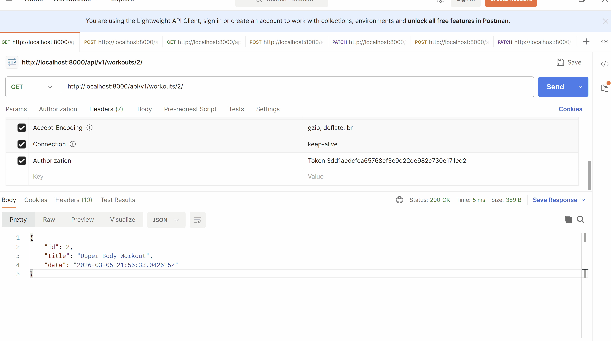
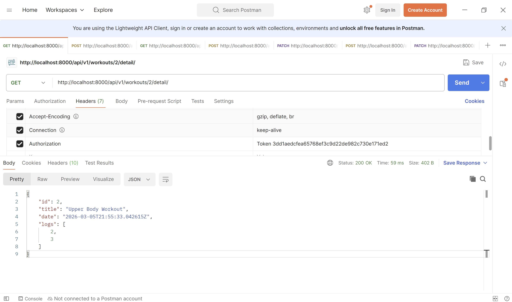
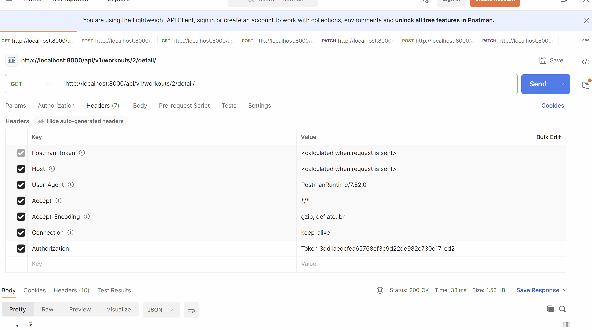
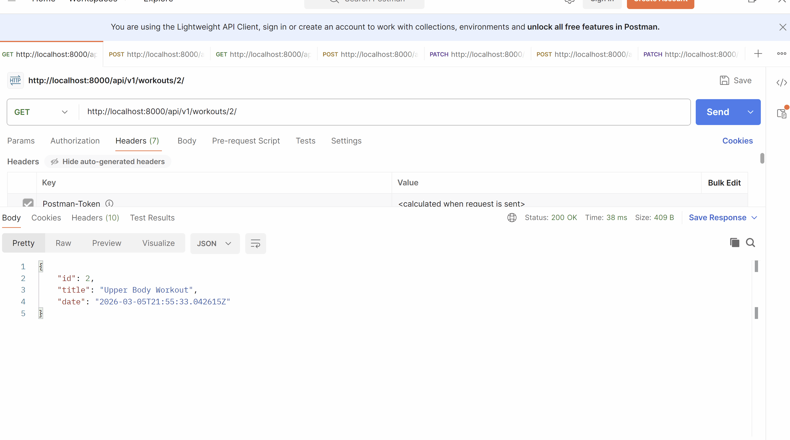
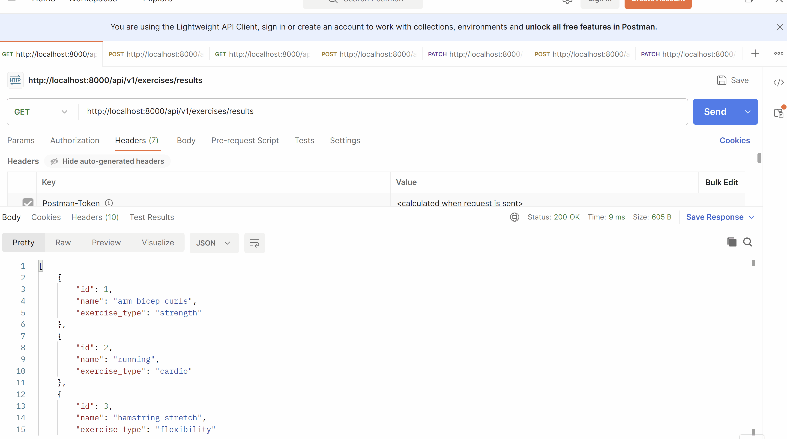

# DRF APIs with more Auth, more Permissions and User associated data.


## Prerequisites
- Create a new virtual environment and install the packages from the `requirements.txt` file.

## Steps

So far we've learned that `APIViews` are the most basic way to create endpoints in DRF and `viewsets` are a powerful way to create endpoints but have a lot of implied functionality.

In this example we're going to learn some more functionality of viewsets and some small tidbits about serializers.

We're going to do this by make a workout detail endpoint that you can see the entire log of a workoutlogs.

### 1. Let's add the user to the `Workout` model in the file `workouts_app/models.py` and make the necessary migrations and migrations.

Add the user to the workout model and make the necessary migrations and migrations.
```python
class Workout(models.Model):
    # add the user to the workout model.
    user = models.ForeignKey(
        settings.AUTH_USER_MODEL,
        on_delete=models.CASCADE,
        blank=True,
        null=True
    )
    title = models.CharField(max_length=100)
    date = models.DateTimeField(auto_now_add=True)


    def __str__(self):
        return f"{self.title}"
```
This is done for ease of users to be able to be access the workouts that hey have created.

You might be thinking this is not normalized since we have the user on the workout logs as well, but this is a common pattern to make it easier to access the data that is relevant to the user.

### 2. Let's add a custom action to the `WorkoutViewSet` to get the workout logs for a workout in the file `workouts_app/views.py`.

Let's make a custom action (which is an extra endpoint on the viewset) to get the workout logs for a workout.


```python
from rest_framework.decorators import action

# ... other imports ...

class WorkoutViewSet(viewsets.ModelViewSet):
    # ... other code ...
    permission_classes = [IsAuthenticated]
    queryset = Workout.objects.all()
    serializer_class = WorkoutSerializer

    @action(detail=True, methods=['get'], url_path='detail')
    def workout_logs(self, request, pk=None):
        workout = self.get_object()
        serializer = WorkoutSerializer(workout)
        return Response(serializer.data)
```
Let's talk about what this code is doing.
- The `@action` decorator is used to create a custom action on the viewset (you can think endpoint).
- `detail=True` means that this endpoint is for a specific workout (it will require the workout id in the url).
- `methods=['get']` means that this endpoint will only respond to GET requests.
- `url_path='detail'` means that the url for this endpoint will be `/workouts/{id}/detail/`.
- In the method, we get the workout object using `self.get_object()`, which is a built-in method that retrieves the object based on the URL parameters.
- We then serialize the workout object and return the serialized data in the response.

Now if we go to the endpoint `/workouts/{id}/detail/` we can see the workout data but you don't see the workout logs. This is because we are using the `WorkoutSerializer` which does not include the workout logs.

It should look something like below, this shows that:
- the `/workouts/{id}/detail/` endpoint is working and returning the workout data and is returning the same data as `/workouts/{id}/`.


### 3. Let's make a new serializer that includes the workout logs, in the file `workouts_app/serializers.py`.

#### 3.1 Add the serializer for the workout detail that includes the workout logs.
We're going to add a `WorkoutDetailReadOnlySerializer` that includes the workout logs and use that serializer in the custom action.

```python
from rest_framework import serializers
# ... other imports ...

# ... workout serializer ...

class WorkoutDetailReadOnlySerializer(serializers.ModelSerializer):
    class Meta:
        model = Workout
        fields = ['id', 'title', 'date', 'workout_logs']

# ... other serializers ...
```
Now if you go to the endpoint `/workouts/{id}/detail/` you should see the workout logs ids in the response. As shown below.



#### 3.2 Let's update the `WorkoutDetailReadOnlySerializer` to include the data from the workout logs instead of just the ids.

In DRF you can use something call "depth" to include related data in the serializer. This is a quick and easy way to include related data without having to create a new serializer for the related model.

```python
class WorkoutDetailReadOnlySerializer(serializers.ModelSerializer):
    class Meta:
        model = Workout
        fields = ['id', 'title', 'date', 'logs']
        depth = 2
```
Let's talk about what this code is doing.
- The `depth` option tells DRF to include related data up to a certain depth. In this case, we set it to 2, which means that it will include related data for the workout logs and also include related data for the exercises in the workout logs.
- This is a quick and easy way to include related data without having to create a new serializer for the related model.
  - There some unintended consequences of using depth, such as it can include more data than you want and it can be less performant than creating a custom serializer for the related model. So use it with caution.


Now if you go to the endpoint `/workouts/{id}/detail/` you should see the workout logs data in the response. As shown below.

- You can see that there's too much data here, we don't want our `user` password data to be included in the response, and we also have `workout` data as we're fetching the specific workout data. This is the unintended consequence of using `depth`, it can include more data than you want. So use it with caution.

#### 3.3 Let's create a custom serializer for the workout logs and use that in the `WorkoutDetailReadOnlySerializer` instead of using depth.

Let's add a another readonly serializer for workout logs that only includes the field that we want to include in the workout detail endpoint.

```python

class WorkoutLogSimpleDetailReadOnlySerializer(serializers.ModelSerializer):
    class Meta:
        model = WorkoutLog
        fields = ['id', 'sets', 'reps', 'weight_kg', 'exercise', 'time']
        # included depth so that the exercise field will include the exercise's information in the response instead of just the exercise id.
        depth = 1


# Serializer for workout detail that includes the workout logs.
class WorkoutDetailReadOnlySerializer(serializers.ModelSerializer):
    # include the workout logs in the response
    logs = WorkoutLogSimpleDetailReadOnlySerializer(many=True, read_only=True)
    class Meta:
        model = Workout
        fields = ['id', 'title', 'date', 'logs']
        # removed depth since we're now using a custom serializer for the workout logs that includes the related exercise data.
```
Let's talk about what we added here.
- We created a new serializer `WorkoutLogSimpleDetailReadOnlySerializer` that includes the fields that we want to include in the workout detail endpoint for the workout logs.
  - in this serializer we also included `depth=1` so that the exercise field will include the exercise's information in the response instead of just the exercise id.
- In the `WorkoutDetailReadOnlySerializer` we added a new field `logs` that uses the `WorkoutLogSimpleDetailReadOnlySerializer` to serialize the workout logs data and include it in the response for the workout detail endpoint.
- We set `many=True` because a workout can have many workout logs.

Let's take a look at the response for the workout detail endpoint now and difference between the builtin detail endpoint and the custom detail endpoint.


### 4. Let's make the queryset for the `WorkoutViewSet` so that it only returns the workouts for the authenticated user in the file `workouts_app/views.py`.

This is pretty small change but it's a good idea to only return the data that is relevant to the user.

```python
# ... other imports ...

class WorkoutViewSet(viewsets.ModelViewSet):
    permission_classes = [IsAuthenticated]
    queryset = Workout.objects.all()
    serializer_class = WorkoutSerializer

    def get_queryset(self):
        return super().get_queryset().filter(user=self.request.user)

# ... other code ...
```
Let's talk about what we added here.
- We added a `get_queryset` method to the `WorkoutViewSet` that filters the
queryset to only return the workouts that belong to the authenticated user.
- This is done by calling the `super().get_queryset()` method to get the original queryset and then filtering it using the `filter` method to only return the workouts where the `user` field matches the authenticated user (`self.request.user`).
- Now when we go to the endpoint to get the list of workouts, we will only see the workouts that belong to the authenticated user.

### 4. Let's give users the ability to search for exercises by name (in a new view) using the search filter backend in the file `workouts_app/views.py`.

#### 4.1 Let's talk about filter backends in DRF.

Filter backends in DRF are a powerful way to add filtering functionality to your API endpoints. They allow you to filter the queryset based on certain criteria, such as search terms, ordering, or custom filters.

We'll be using using the `SearchFilter` backend to allow users to search for exercises by name. Note the [docs are here](https://www.django-rest-framework.org/api-guide/filtering/#searchfilter) if you want to take a look.

#### 4.2 Let's add a new `ExerciseSearchView` view to search for exercises by name using the `SearchFilter` backend in the file `workouts_app/views.py`.


```python

from rest_framework import filters
# ... other imports ...

class ExerciseSearchViewSet(viewsets.ReadOnlyModelViewSet):
    permission_classes = [IsAuthenticated]
    queryset = Exercise.objects.all()
    serializer_class = ExerciseSerializer
    filter_backends = [filters.SearchFilter]
    search_fields = ['name']

# ... other code ...

```
Let's talk about what we added here.
- We created a new viewset `ExerciseSearchViewSet` that inherits from `ReadOnlyModelViewSet` since we only want to allow read operations for this viewset.
- We set the `queryset` to be all exercises and the `serializer_class` to be the `ExerciseSerializer`.
- We added the `filter_backends` attribute and set it to a list that includes the `SearchFilter` backend. This tells DRF that we want to use the search filter functionality for this viewset.
- We added the `search_fields` attribute and set it to a list that includes the field `name`. This tells DRF that we want to allow searching for exercises based on the `name` field.


#### 4.3 Let's add the url for the `ExerciseSearchViewSet` in the file `workouts_app/urls.py`.

```python
from django.urls import path, include
from rest_framework.routers import DefaultRouter

from .views import (ExerciseAPIView, WorkoutViewSet, WorkoutLogAPIView,
                    ExerciseSearchViewSet)

from rest_framework.routers import DefaultRouter

from django.urls import path

router = DefaultRouter()
router.register(r'workouts', WorkoutViewSet, basename='workout')
router.register(r'exercises/results',
                ExerciseSearchViewSet,
                basename='exercise-search')

# ... urlpatterns ...
```
- Now we can go to the endpoint for this viewset and use the search functionality to search for exercises by name. For example, if the endpoint is `/exercises/results/`, we can go to `/exercises/results/?search=squat` to search for exercises that have "squat" in their name.

#### 4.1 Let's test out the search functionality in Postman
- Go to the endpoint for the `ExerciseSearchViewSet` (e.g. `/exercises/results/`) and add the search query parameter to search for exercises by name (e.g. `/exercises/results/?search=arm`).

Let's take a look at what this looks like:


**Notes on More Complex Search**
Search is a complicated and difficult thing to do well. What you can do in the future is use a more powerful search engine such as:
- ElasticSearch (or OpenSearch which is the open source version of ElasticSearch) built on Apache Lucene
  - Github, Airbnb, Uber and more.
- Apache Solr built on Apache Lucene
  - used by companies like Netflix, Apple, Adobe and more
- Algolia (hosted search engine)
  - used by companies like Shopify, Stripe, and Twitch.

As well normally this takes in a lot of infrastructure and setup to get working well, so it's not something that you would normally implement in a small project or a project that is just starting out, but it's something to keep in mind for the future if you want to add powerful search functionality to your application.

## Challenge/Exercise

### 1. Add a `WorkoutPlan` model that has a many to many relationship with the `Workout` model and add an endpoint to get the workout plans for a user that includes the workouts in the workout plan.
- The `WorkoutPlan` model should have a `name` field and a many to many relationship with the `Workout` model.
- It should have `FileField` to upload a pdf of the workout plan.
- The endpoint to get the workout plans for a user should be a custom action on the `WorkoutViewSet` that returns the workout plans for the authenticated user and includes the workouts in the workout plan.
- Add the urls for the new endpoint and test it out in Postman or the browsable API.

## Conclusion

In this example we learned about:
- How to use custom actions on viewsets to create custom endpoints.
- How to use the `depth` option in serializers to include related data in the response.
- How to create custom serializers for related data to have more control over the data that is included in the response.
- How to filter the queryset in a viewset to only return data that is relevant to the authenticated user.
- How to use the `SearchFilter` backend to add search functionality to an endpoint.
- We also talked about the limitations of using `depth` in serializers and how it can include more data than you want, so it's important to use it with caution.
- We also talked about more powerful search engines that you can use in the future if you want to add more powerful search functionality to your application.
